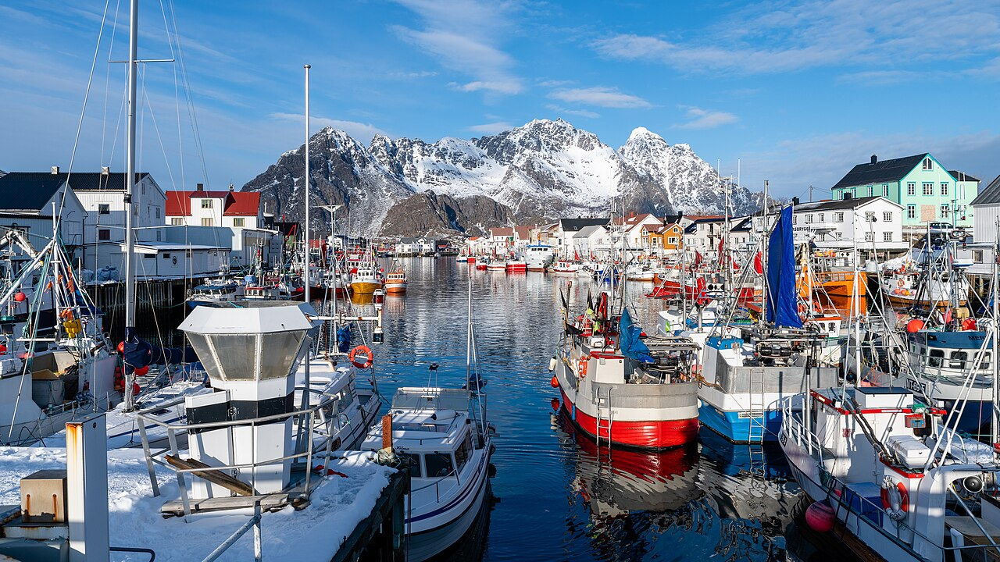
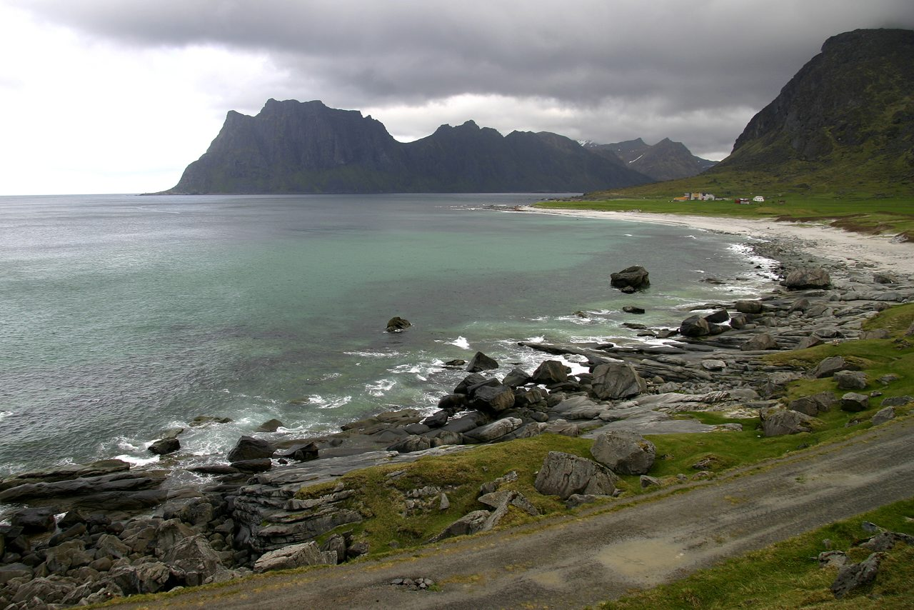
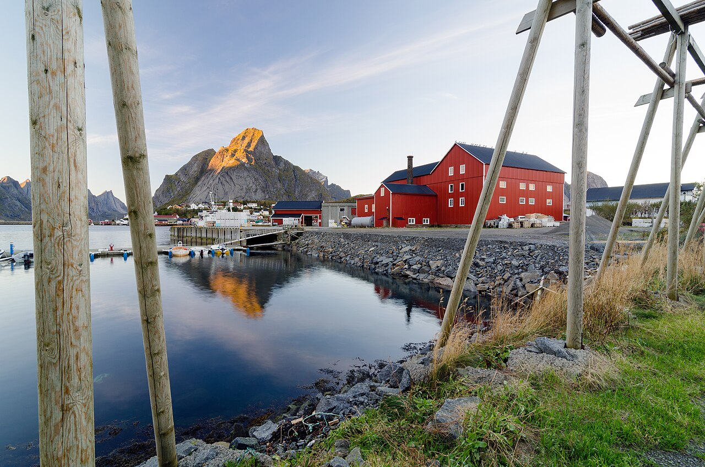

# 罗弗敦 2026 年 10 月初 · 行程框架 / 自驾路线 / 住宿深度分析

> **本分析由 DeepSeek 生成** · 生成日期 2026-09-16 · 数据截至 2026-09-16
> 配套可视化版本：`罗弗敦10月行程方案-深度分析-deepseek.html`
> 本文基于公开信息整理 + 作者自行推算，标注方式见文末《数据来源与不确定性声明》。

---

## 0. 结论速览

| # | 结论 | 理由摘要 |
|---|---|---|
| 1 | **10/2 → 10/4 不要安排 3 个不同住处** | 极光成败的第一主导变量是"同一地点连续几晚 × 当晚云量"，不是"哪一晚住得更有特色"。每搬一次家，就多一个"首夜"——新住处的暗夜视野与路况需要现场确认，**第一晚信息量最低**；但这不是"吃掉夜晚时间"（本行程各次移动都短、且都发生在白天，详见 §3.3） |
| 2 | **【Midnattsolveien 4345, Hadsel】不该放在 10/2** | 位置对（北向外海，极光视野确实比 Henningsvær 好），但代价是到达日多绕 1.5–2 小时、且 10/3 一早就得往回开。详见 §6.1 |
| 3 | **【Nusfjord】“住不住”要分天气看，不能一刀切** | 已核实：村子在狭窄峡湾尽头，**东西两侧被陡壁夹住、被全岛最高山环绕** —— 它的天空是“一道缝”，不是“一整片”。更关键的是：**它是个收费古渔村（约 100 NOK/人、闸口 07:00 开）**，而最好的两小时正是游客散去后的黄昏与开门前的清晨。**天气差 → 住（渔村体验 + 度假村餐厅解决周日晚饭）；天气有机会晴 → 不住（别把无月夜浪费在只能从山缝看天的地方）**。详见 §6.2 + §8.1～§8.4 |
| 4 | **10/5 晚上住 EVE 附近的 Sandtorgholmen（不要住奥斯陆，也不要住罗弗敦西部）** | 10/6 是国际航班日（14:00–14:30 值机、17:00 起飞）。航班时刻已核实（⚠️ 机票尚待订）：10/6 上午有 **10:50→12:30（SAS）· 11:05→12:50（挪威）** 两班可用，相隔仅 15 分钟、互为**弱备份**。住 EVE 附近只要 30–45 分钟车程，**既保住 10/5 这一晚的极光窗口（21:00–02:00，全程第三好），又把 10/6 早上的风险压到最低**；10/5 晚 20:05→21:50 飞回奥斯陆则作为"零风险退路"同时下单对冲。详见 §3.4 |
| 5 | **10/4 是周日 —— 挪威商店基本全关** | 2026-10-01 是周四 → 10/4 是周日。必须**在 10/3（周六）于 Leknes 把两天食补给买齐**。详见 §3.5 |
| 6 | **月相条件全程意外地好** | 下弦月 10/3、新月 10/10 → 每晚 21:00 起都有一段 1.5–3 小时的无月窗口，10/3、10/4 的窗口最长。详见 §5.2 |
| 7 | **"西边天气比东边好"这个假设是错的** | Skrova 年降水 819 mm，Svolvær 1,500 mm，Leknes 1,546 mm。差异来自**地形抬升**，不存在干净的东西向梯度。不要按这个东西排住宿 |
| 8 | **唯一推荐的徒步：Hoven（Gimsøya，368 m）** | 落差小、坡缓、360° 视野、往返约 1–1.5 小时，且在 E10 边；正好是你"早起独自去、对象留住处"的那一次。**Reinebringen（1,978 级台阶）与 Ryten 强烈不建议** |
| 9 | **10/2→10/4 最优住宿顺序：让“更好的那一晚”待在“更好的天空”上** | 10/4 的无月窗口（≈4.5 h）比 10/3（≈3.7 h）更值钱 → **方案 I（10/3 雷纳 → 10/4 Nusfjord）是最差的一种，它恰好把好夜浪费在山缝里**。极光最优 = **10/3+10/4 都住 Ramberg**；想住 3 个地方 = **10/3 Hamnøy/Reine → 10/4 Ramberg/Ballstad**（10/4 的东返本来就是要走的路，不浪费）。详见 §8.5 |
| 10 | **10/2 的住宿，用“价格/便利/体验”选，不要用“北向天空”选** | 10/2 是三个晚上里极光条件最差的一晚（无月窗口仅 ≈2.8 h、月光 ≈68%）。**Henningsvær Bryggehotell（省心+早餐）与 Astra Village Kabelvåg（最便宜+真 rorbu+10/3 早起零绕路）二选一**。⚠️ **但先纠正一个退改口径：Astra 的"24 小时内可退"指的是"订房后 24 小时内可退、之后不可退"——它是三者里灵活性最低的；真正能把决定权留到出发前的是 Banhammaren 39 的"9/27 前可退"**。详见 §8.6 |

---

## 1. 建议的最终骨架（一页版）

```text
10/1 四  OSL 汇合（对象 14:30 · QR175 自多哈 / 你 15:55 · SK4788 自雷克雅未克）
         └─ 方案已定（⚠️ 机票尚未购买、仍待订）：两人同行按"较晚落地的你"算 —— 17:55 那班余量只剩约 65 分钟（临界）→ 走 21:00 → EVE 22:40
         └─ 自助取车 → 沿 E10 顺路 30–45 分钟 → 住 Sandtorgholmen（≈23:20 到店）

10/2 五  【住 Henningsvær 或 Kabelvåg】东部
         EVE 取车 → E10 → Raftsundet 桥 → Fiskebøl → 罗弗敦群岛
         → Rørvikstranda → Kabelvåg → Henningsvær（港口 + 海上足球场）

10/3 六  【住 Ballstad 或 Ramberg】中部西移  ← 全程极光条件最好的一晚之一
         Gimsøya / Hov（Hoven 短徒步）→ Gimsøystraumen 桥 → Lofotr 维京博物馆
         → Eggum → Unstad → Leknes【周六采买两天食补】
         → 傍晚 Haukland / Uttakleiv，夜间就地守光

10/4 日  【住 Hamnøy（体验型）或续住 Ballstad/Ramberg（极光型）】西线经典
         Ramberg → Skagsanden → Nusfjord（白天）→ Flakstad 教堂
         → Fredvang 桥 → Kåkern 桥 → Hamnøy 桥观景点 → Sakrisøy → Reine → Å
         ⚠️ 周日：商店多数关门

10/5 一  收尾 + 回程
         A（推荐）上午继续玩 → 15:00 前出发 → EVE 自助还车 → 住 Sandtorgholmen（E10 顺路）
                  → 晚间守光（21:00–02:00 窗口）
         B（零风险退路）EVE 自助还车 → 20:05 → OSL 21:50 → 住奥斯陆（放弃当晚极光）
         （A 与 B 都订可退的，10/5 下午在 EVE 一带按 10/6 早上路况预报现场二选一，见 §3.4）

10/6 二  08:45 出发 → EVE 还车 → 10:50→12:30（SAS）或 11:05→12:50（挪威）
         → 14:00–14:30 OSL 值机托运 → 17:00 起飞（经多哈）→ 10/7 18:05 抵杭州
```

---

## 2. 地图

交互地图见配套 HTML（`罗弗敦10月行程方案-深度分析-deepseek.html`），使用随文件下发的**本地瓦片金字塔**（z6–z11，覆盖罗弗敦全域），`file://` 打开或断网都能显示真地图。

地图上共三层：

1. **官方坐标层** — 直接复用你 `lofoten.html` 里已标注并核对过的 58 个点（机场 / 住宿区 / 景点 / 极光点 / 徒步起点），坐标不重新估算。
2. **你的候选住处层** — 把你列的 14 个备选住宿落到图上。**其中带 `≈` 的点是街区级近似坐标**，原因见 §7。
3. **路线层** — 推荐主线（A）与"10/4 住 Hamnøy"支线（B）。


*亨宁斯韦尔（Henningsvær）：港口、画廊与著名的海上足球场。10/2 的推荐落脚点。*


*乌塔克莱夫（Uttakleiv）：戏剧性海岸线，北向开阔，是很强的守光点。*


*莱讷（Reine）：罗弗敦的明信片画面，适合白天；但返程压力大，不宜放最后一晚。*

---

## 3. 任务一：行程框架合理性审查

**总评：框架整体是合理的**——东部先进、中部西移、西线收尾、最后从 EVE 附近飞回奥斯陆，这个顺序没有结构性错误。（你原来留了"10/1 是否当晚飞"的弹性，这点很对——现在航班时刻已核实，方案可以收口：10/1 应订 21:00 班飞 EVE 并住 Sandtorgholmen（§3.1），10/5 住 EVE 附近 + 持有可退的奥斯陆酒店做对冲（§3.4），10/6 走 10:50 / 11:05。⚠️ 但要注意：**这些 OSL↔EVE 机票目前都还没有购买，是待定状态** —— 本文给的是"应该订哪一班"，不是"已经订好哪一班"。）

但有 **5 个具体的点需要修正**，其中 2 个是真问题，3 个是需要提前锁死的风险。

### 3.1 10/1：航班时刻已核实 —— 走"飞 EVE + 住 Sandtorgholmen"

**第一步：确认你们是"分头落地"（2026-09-16 你补充的信息）**

| 谁 | 国际段 | 落地 OSL | 入境性质 | 处理时长（估算） |
|---|---|---|---|---|
| 对象 | **QR891** 杭州 → 多哈，转 **QR175** 多哈 → 奥斯陆 | **14:30** | **非申根入境**（多哈 → 挪威）：护照查验 + 海关 | 55–90 分钟 |
| 你 | **SK4788** 雷克雅未克 → 奥斯陆（直飞） | **15:55** | **申根内部**：无护照查验，直接到行李转盘 | 40–55 分钟 |

⇒ **两人同行，节奏必须按"较晚落地的你"算。** 对象那 3h25 的余量是真实的 —— 足够取行李、过关、吃顿饭，甚至顺便踩点国内值机柜台的位置；**而你只有 2h00**。你少一道护照查验，但行李照样要等，两人大致在 **16:20–16:40 前后**才在抵达大厅碰面。

**第二步：10/1 OSL→EVE 只有两班（均挪威航空）**

| 航班 | 起飞 → 落地 | 距对象落地（14:30） | 距你落地（15:55） | 判定 |
|---|---|---|---|---|
| ① | 17:55 → 19:35 | 3h25，宽裕 | **仅 2h00** | 🔴 临界偏负，不建议 |
| ② | **21:00 → 22:40** | 6h30 | 5h05，从容 | ✅ **选它** |

**① 临界偏负，不建议赌。** 你的 OSL→EVE 是**单独买的票**（按本文规划，它不是与国际段同一订单），因此必须在 OSL 入境、**取出行李、再重新托运**。17:55 那班的行李托运截止约 **17:25**（国内段一般起飞前 30 分钟关闭托运），而你 15:55 才落地：

```text
对象（非申根 14:30）：下机 10′ → 护照查验 20–40′ → 等行李 15–30′ → 海关/上楼 10′   ≈ 55–90′
你  （申根内部 15:55）：下机 10′ → 等行李 20–35′ → 上楼 10′                       ≈ 40–55′
→ 你约 16:35–16:50 才到国内柜台（行李截止 17:25），之后还要过安检（10–25′）
```

⇒ **你这边只剩约 10–40 分钟余量，而且"托运完成 ≠ 能登机"**：之后还要过安检（10–25′），17:55 那班约 17:25 开始登机、17:50 前后关舱门 —— 也就是说你实际需要在 **17:00 前**就把行李交掉，从落地算起只有约 **65 分钟**，而上面这条链路估算要 **40–90 分钟**。这是一个**期望值为负的抛硬币**。

**为什么"赶不上"的代价不对称（这才是真正的理由）：**

- 你的两段票是**分开买的**。国际段晚点导致误机，**航空公司不承担任何责任** —— 你只能自费重买。
- 你列出的 10/1 OSL→EVE 只有 **17:55 与 21:00 两班**，**21:00 是当天最后一班**。万一 17:55 没赶上、而 21:00 也已满座，你就**只能睡在奥斯陆，10/2 早上再飞（08:40 SAS / 08:55 挪威）** —— 直接损失 10/2 大半天，Sandtorgholmen 的订房也要重来。
- 反过来，**直接订 21:00 是零下行风险**：5h05 的余量，落得早你还能在奥斯陆吃顿正经晚饭。而 17:55 抢到的那 3 小时，本质上只等于"多睡 3 小时"—— 因为 **10/1 那一晚的极光本来就拿不到**（见本节末）。顺带说：若真走 ①，EVE 19:35 落地 → Sandtorgholmen 约 20:20，理论上还能接住 10/1 的 21:00–23:00 窗口，但那晚月光 78%、沙角又是**西向**而非北向，价值极低。

> **所以结论不变：两班一起走 ②。**

**为什么不"拆开来飞"（对象走 17:55、你走 21:00）？** 看起来两全其美，实际是把你一个人丢在 EVE：车在 19:35 就被对象开走了，你 22:40 落地后要么**深夜在 Evenes 叫 30–45 公里出租车**（偏远地区车少，基本得提前预订），要么对象**开回机场接你**（往返约 70 公里 / 1 小时 10 分，到店已过午夜）。为了 3 小时睡眠，不值得把最后一公里变成新的薄弱环节。

**② 是正确的选择，但落点不是罗弗敦，而是 Sandtorgholmen。**

21:00 → EVE 22:40 落地。此时**不要**再开 2 小时 25 分到 Svolvær（= 凌晨 02:30 才到，还要过 Gimsøystraumen 桥 —— **这座桥被描述为"暴露在罗弗敦最恶劣的天气之一"**）。

**关键事实：Sandtorgholmen（Sandtorg，Hinnøya）就在 E10 上、EVE 沿 E10 往罗弗敦方向约 30 公里处 —— 它不是绕路，它正好挡在 EVE 和罗弗敦之间。** 22:40 落地 → 自助取车 → 30–45 分钟 → **约 23:20 到店**。

> ✅ **已确认：EVE 的租车行提供自助取车 / 自助还车**，所以 22:40 落地后当晚就能把车开走，这条路径成立。

**结论（原来的"19:00 硬线"已废除）：**

> **10/1 直接走 21:00 → EVE 22:40 → Sandtorgholmen 过夜；10/2 早上从 Sandtorgholmen 出发进岛（≈3h20 到 Henningsvær）。**
> **不要**在 10/1 当晚开进罗弗敦；**也不要**因为"落地太晚"而退回奥斯陆 —— 退回奥斯陆要多飞一段、10/2 还晚到约 2.5 小时。

⚠️ **退改档次要看清**：Sandtorgholmen 的「当天 16:00 前可退」能一直保留到**到达当日 16:00**；而「24 小时内可退」只是**订房后 24 小时内可退、之后不可退**，**帮不上临场决策**（详见 §8.6）。

⚠️ **10/1 的极光基本拿不到**（当晚窗口仅 21:00–23:00、月光 78%，而你 23:20 才到店）—— 所以这一晚"牺牲掉"几乎零成本，这正是可以用它换 10/2 白天时间的原因。

### 3.2 10/2 不应该叠加远程住宿

**问题**：你在 10/2 的候选里混进了 Midnattsolveien 4345 —— 它跟另外三个选项**根本不在同一个地理体系里**（前三个都在 Svolvær–Kabelvåg–Henningsvær 的 E10 走廊上，第四个在外海侧农村路上）。这不是"哪个更好"的问题，而是**你会不会在到达日开 4.5–5 小时车**的问题。

**怎么改**：见 §6.1。10/2 就在 E10 走廊上住。

### 3.3 10/3–10/4 拆成两个住处，是本次最伤极光的安排

**问题**：你的选项 4 和 5 都是"10/3 住 A + 10/4 住 Eliassen Rorbuer（Hamnøy）"。加上 10/2，就是 **3 晚 3 个住处**。

而极光的数学是这样的：**能不能看到，主要由"你在同一个地方连续耗了几个晚上"和"那几个晚上云量如何"决定。** 10 月初的罗弗敦，10 天里通常有 4–6 天是阴雨（依据见 §5.4）。如果你只有 3 个晚上，且每天都在搬家，你实际上是在用 3 个独立的夜晚去赌天气，但**搬家真正消耗的不是夜晚时间**：退房（约 10:00–11:00）到入住（约 15:00–16:00）的空档全部落在白天（10 月初日出 ≈07:25、日落 ≈18:15，见 §5.1），收拾、装车、办入住都在日光下完成；真正的代价是 ① 那次移动占用**白天看风景**的预算，② 新住处的暗夜视野需要现场确认、**第一晚信息量最低**。

**怎么改**：把 10/3 和 10/4 连住在**同一区域**（Ballstad 或 Ramberg/Skagsanden），只保留 10/2 的一次搬家。这样是 2 个住处、1 次移动，你已经满足"住 2 个地方以上"的愿望，同时把 2 个最宝贵的夜晚押在同一个北向开阔的地点上。

如果你确实想住 3 个地方，**只加在 10/4 一晚**（Hamnøy 的 Eliassen Rorbuer，1,963 元一室，是全表最划算的经典渔屋），并接受 10/5 回 EVE 要开约 4 小时 15 分。

### 3.4 10/5–10/6：航班时刻已核实 —— 结论从"必须住奥斯陆"改为"住 EVE 附近 + 对冲" ⚠️

**已核实的返程航班**

| 日期 | 方向 | 航班 | 判定 |
|---|---|---|---|
| 10/5 | EVE→OSL 晚 | 17:15 → 19:00 · **20:05 → 21:50**（挪威航空） | 可作"零风险退路" |
| 10/6 | EVE→OSL 早 | 06:15 → 08:00（SAS）· 06:30 → 08:15（挪威）· **10:50 → 12:30（SAS）** · **11:05 → 12:50（挪威）** | 只有 **10:50 / 11:05** 可用 |

**06:15 与 06:30 直接排除。** 它们要求你 04:45 到 EVE（从 Ramberg 出发等于 00:50 起床），而且**把 10/5 那一晚彻底吃掉** —— 10/5 的无月窗口是 21:00–02:00，你根本没有睡觉的余地。零收益、双损失。

**10:50 与 11:05 是唯一现实的两班**，落地 OSL 12:30 / 12:50，距 14:00 值机还有 1h10、距 17:00 起飞还有 4h10，**时间完全够**。而且两班**相隔 15 分钟、分属 SAS 与挪威航空**，构成一个**弱备份**（一班取消时另一班大概率能接住，但要付改签/重购成本；真正的天气性停飞会同时打掉两班）。

**剩下的问题只有一个：10/5 那一晚你睡哪。** 本质是拿 10/5 的 4 小时无月窗口（21:00–02:00、月光仅 32%、**全程第三好**）去换 10/6 早上的安全边际：

```text
10/5 住处 → 开车到 EVE（30 分钟 ~ 3h50）→ 自助还车（约 0.5–1 h）
   → EVE → OSL 航班（约 1h40）→ OSL 值机托运
```

| | 10/5 住哪 | 到 EVE | 10/6 需出发 | 10/5 极光 | 10/6 风险 |
|---|---|---|---|---|---|
| **A（推荐）** | **Sandtorgholmen**（E10 顺路） | ≈28–30 km / 30–45 分钟 | ≈08:35–08:45 | ⭕ 西向开阔海平线（**不是**"北向"，属折中档） | 🟢 极低 |
| B（极光优先） | **Gimsøya / Hov 或 Kleppstad**（E10 上） | ≈197 km / ≈3h00 | ≈06:25 | ✅✅ 原文认定的顶级北向开阔区 | 🟡 中（含 Gimsøystraumen 桥） |
| C（零风险退路） | **奥斯陆**（10/5 晚 20:05 飞到） | — | 不用飞 | ❌ 完全放弃 | 🟢 零 |
| D | Svolvær / Kabelvåg | 164–172 km / 2h25–2h35 | ≈06:55 | ⭕ 一般（港湾朝向，北向被山挡） | 🟡 中 |
| E | **Ramberg / Ballstad** | 240–257 km / 3h35–3h50 | ≈05:30–05:45 | ✅✅ 原文"本区极光选址第一档" | 🔴 **高** |

**怎么改**：

- **主结构（推荐）：10/5 住 EVE 附近的 Sandtorgholmen，10/6 走 10:50 或 11:05。**
  你已经把 10/3 + 10/4 连住在 Ramberg —— **全程最好的两个窗口已经在最好的地方了**，10/5 的边际价值本来就低一档。住 Sandtorgholmen 只需 30–45 分钟车程，**几乎等于"住奥斯陆"级别的安全，却保住了 10/5 一整晚的守光机会**。
- **对冲操作（A + C 同时下单）：** 10/5 你本来就要开车往东走，**两张可退订单都先占住**（Sandtorgholmen + 奥斯陆市区/机场酒店）。10/5 下午你人正好在 EVE 一带，那时看 10/6 早上的 E10 路况/风力预报：
  - 预报正常 → 住 Sandtorgholmen，10/6 走 10:50 / 11:05；
  - 预报差（雨雪、强风、封路）→ 当场自助还车、上 **20:05 → 21:50** 那班飞奥斯陆，10/6 零飞行风险。
- **极光优先版（B）：** 若你更看重最后一晚的天空质量，把 10/5 的住处放到 **Gimsøya / Hov（或 Kleppstad）** —— E10 上、零绕路、原文用整节（§6.1）论证过的顶级北向开阔区；06:25 出发意味着只有约 50 分钟是黑夜驾驶（10/6 日出 ≈07:40）。代价是最后一晚要早起，且需另行落实 Gimsøya 一带的住宿。
- **不要做的事：** ① 10/6 走 06:15 / 06:30；② 10/5 住在 Ramberg / Ballstad 却要赶 10/6 上午的飞机 —— 3h40 黑夜山路，而失败的代价是赶不上 17:00 的**国际**航班。这个赌注不对称。

> **一句话：10/5 的正确落点是"EVE 附近"（Sandtorgholmen 或 Gimsøya），不是奥斯陆，也不是罗弗敦西部。**
> 本文早先版本写的是"10/5 晚上一定睡在奥斯陆"，那是建立在"10/6 上午航班时刻未知"的前提上；时刻核实之后，这个结论需要下调。

### 3.5 10/4 是周日：挪威商店基本全关

**2026-10-01 是周四**（已推算），因此：

| 日期 | 星期 |
|---|---|
| 10/1 | 四 |
| 10/2 | 五 |
| 10/3 | **六** |
| 10/4 | **日 ← 商店/超市多数关门** |
| 10/5 | 一 |
| 10/6 | 二 |

**后果**：如果你遵循"10/3 住 Nusfjord、10/4 住 Hamnøy/Reine"这条线，那么 Nusfjord 村内没有超市，而 10/4 又全岛商店关门——**你可能连续 36 小时买不到食物**。Reine/Hamnøy 那边有一些小 Coop，但周日营业时间和库存都要打问号。

**怎么改**：**把"在 Leknes 采买 10/3 晚 + 10/4 全天 + 10/5 早饭的食补"写进 10/3 的固定行程里。** Leknes 是中西部唯一的真正超市枢纽（已核实：Leknes 是罗弗敦+韦斯特龙人口最多的聚居地），错过它，后面全是小卖部。

> 营业时间请以当地实际为准，本文只提示"周日闭店"这一结构性约束。

### 3.6 其他 4 个需要提前锁死的小项

| 项 | 说明 |
|---|---|
| **冬季胎** | 10 月罗弗敦已可能降雪，山路与桥梁易结冰。务必**取车时确认已装冬季胎**。Nordland 通常自 10 月 16 日起允许钉胎（据公开信息，具体以 Statens vegvesen 公告与租车公司为准） |
| **徒步只安排 1 次** | 见 §5.5。你对象膝盖不好，把徒步做成"你早起独自去、她留住处"是对的；请提前把当天早饭和活动告诉她，别让她在陌生民宿干等 |
| **渡轮/隧道** | 如果你最终选了"不走回头路"版本（Moskenes→Bodø 车渡轮），10 月强风/海况可能导致停航，且车渡轮需提前预订。你在原文里没提这条，我也**不建议本次用**——它会打乱 10/5–10/6 的节奏 |
| **10/6 值机时间** | 14:00–14:30 到 OSL，距 17:00 起飞 2.5–3 小时，是合理的；但注意你是经**多哈**中转（次日 00:30 到 DOH、04:34 起飞、10/7 18:05 抵杭州），中转时间很长，不需要额外预留 |

---

## 4. 任务二：10/2–10/5 自驾路线方案

**设计原则**：①风光多样性（渔村 / 白沙滩 / 峡湾 / 外海 / 维京文化 / 明信片机位）；②尽量走 E10 主脊，少走回头路；③夜幕降临时人要在北向开阔的住处附近，而不是在路上；④预留坏天气的降级方案。

### 4.1 10/2（周五）东部 · EVE → Henningsvær

**主题**：进岛 + 第一个渔村日。**当天不追求强度，追求"天黑前安顿好"。**

| 时段 | 内容 | 备注 |
|---|---|---|
| 上午/中午 | EVE 取车（1–1.5 h）→ E10 西北行：Tjeldsund 桥 → Hinnøya → **Raftsundet 桥** → Fiskebøl（进入 Austvågøya） | EVE→Henningsvær 全程 **≈192 km / ≈2 h 45 分**（已核实） |
| 午间 | **Rørvikstranda Beach**（E10 支线旁） | 第一眼罗弗敦白沙滩，20–45 min |
| 下午 | **Kabelvåg** → **Henningsvær** | Kabelvåg 有史前 Vågar 聚落气质；Henningsvær 半岛看港口 + 海上足球场，两处相距很近 |
| 傍晚 | 入住 | **Henningsvær 或回 Kabelvåg**（相距 ≈20–30 min） |
| 夜间 | 若天黑后放晴，本地守光 | ⚠️ Henningsvær 面朝南/西南港湾，**正北被 Austvågøya 山体（最高 1,161 m）挡住**。想守光要往 Kabelvåg/Gimsøya 方向挪 |

**降级方案**：雨雪强风 → 直接砍掉 Henningsvær，住 Svolvær/Kabelvåg，**不要为赶景点在 Gimsøystraumen 桥一带冒险开夜路**。

**驾驶量**：≈200 km / 3–3.5 h（含停靠）

### 4.2 10/3（周六）中部西移 · Gimsøya → Vestvågøy → Haukland

**主题**：外海侧 + 维京文化 + 冲浪海滩 + 两个顶级白沙滩。**今晚是全程极光条件最好的夜晚之一（无月窗口最长）。**

| 时段 | 内容 | 备注 |
|---|---|---|
| 早（可选） | **Hoven（Gimsøya，368 m）** 短徒步 | 落差小、坡缓、360° 视野；往返 ≈1–1.5 h。**对象留在住处**。也可以改到 10/4 早上 |
| 上午 | **Gimsøya / Hov** 海滩 + 高尔夫球场一带 | Gimsøya 属于 Vågan，位于岛屿北缘、正对北方的开阔大海，是公认稳定的极光观测区 |
| 中午 | 过 **Gimsøystraumen 桥**（839 m，1981 年，E10）→ Vestvågøy | 桥上风大 |
| 下午 | **Lofotr 维京博物馆**（雨天备胎）→ **Eggum**（北向开阔极光点）→ **Unstad**（北极冲浪） | 若下雨：维京博物馆优先级上升 |
| 傍晚 | **Leknes 采买两天食补**（重要）| 周六，是最后一次靠谱的采购机会 |
| 日落/夜 | **Haukland Beach** → **Uttakleiv**，就地守光 | 两处均北向开阔，是很强的守光点 |

**驾驶量**：≈95–120 km / 2–2.5 h

**住宿**：**Ballstad**（Hattvika Lodge / Solsiden Brygge / High Standard Lodge）或 **Ramberg**（Jusnesveien 55）。到 Haukland/Uttakleiv 约 20–25 min，到 Leknes 约 15 min。

### 4.3 10/4（周日）西线经典 · Ramberg → Nusfjord → Reine → Å

**主题**：一天把罗弗敦最经典的画面扫完。**注意周日闭店。**

| 时段 | 内容 | 备注 |
|---|---|---|
| 早上 | **Skagsanden Beach** → **Ramberg Beach** | 白沙滩 + 山 + 海的典型组合；也是西北向开阔的守光点 |
| 上午 | **Nusfjord**（白天） | ⚠️ 位于 **E10 以南的山路支线**（Rome2rio：Flakstad→Nusfjord 公路距离 15.6 km），往返 ≈30 km / ≈50 min。历史渔村，**白天价值最高** |
| 中午 | **Flakstad 教堂**（红色木教堂）→ **Fredvang 桥** | 短暂停靠 |
| 下午 | **Kåkern 桥** → **Hamnøy 桥观景点** → **Sakrisøy** → **Reine** → **Å** | 罗弗敦明信片机位密集段 |
| 傍晚 | 二选一 | ①若住 Hamnøy/Reine：就地守光；②若回中部：傍晚返回 **Ramberg/Skagsanden** 守光 |

**Kvalvika / Ryten**：Ryten 起点在 Fredvang 附近，往返 3–5 小时、坡度大、湿滑，且你对象膝盖不好——**本次不建议完整徒步**。若天气极好，最多做 Kvalvika 海滩的短版步行（1.5–2 h，较缓）。

**驾驶量**：Ballstad→Å 单程 ≈55–65 km；含 Nusfjord 支线往返与回程另计。

### 4.4 10/5（周一）收尾 + 回程

| 方案 | 内容 | 评价 |
|---|---|---|
| **A（推荐）** | 上午继续玩 → 15:00 前出发 → **EVE 自助还车** → 住 **Sandtorgholmen**（E10 顺路 30–45 分钟）→ 晚间守光 → 10/6 走 10:50 / 11:05 | Ramberg→Sandtorgholmen ≈287 km / ≈4 h 05（推导值）。**保住 10/5 的极光窗口（21:00–02:00）**，10/6 早上只开 30–45 分钟 |
| **B（极光优先）** | 15:00 前出发 → 住 **Gimsøya / Hov 或 Kleppstad**（E10 上）→ 10/6 ≈06:25 出发 | ≈197 km / ≈3h00 到 EVE。天空是顶级北向开阔区，代价是清晨约 3 小时车程、其中约 50 分钟摸黑 |
| **C（零风险退路）** | **EVE 自助还车 → 傍晚 20:05→21:50 飞 OSL → 住奥斯陆** | 放弃 10/5 那一晚极光，换 10/6 零飞行风险。与 A 同时下单做对冲，10/5 下午在 EVE 一带按路况预报决定（见 §3.4） |

**如果 10/1 已逛过奥斯陆**：10/5 不需要提前回 OSL —— 按上面的 A / B 走，把 10/5 玩满，晚住 EVE 附近。
**如果 10/1 直接飞了 EVE**：同样按 A / B 走；只有当你完全不接受 10/6 早上的任何路面风险时，才选 C。

---

## 5. 极光专题

### 5.1 暗夜窗口（自行推算，标"分析推断"）

以罗弗敦中部（约 68.2°N / 14.6°E）估算：

| 项目 | 10/1 | 10/6 |
|---|---|---|
| 日出 | ≈07:25 | 更晚 |
| 日落 | ≈18:15 | ≈17:30 |
| 民用暮光结束 | ≈19:22 | ≈18:40 |
| 航海暮光结束 | ≈20:28 | ≈19:50 |
| **天文暗夜开始** | **≈21:45–21:50** | **≈21:10–21:20** |
| 天文暗夜结束 | ≈03:50 | ≈03:30 |
| **可用暗夜窗口** | **≈21:30 – 04:00（约 6–6.5 h）** | 同 |

**重要推论**：北挪威极光的统计峰值在**当地磁午夜前后，约 21:00–01:00**。

> **你不需要熬到凌晨 3 点。** 真正值钱的窗口是 **21:30–00:30**。

### 5.2 月相（月相日期为可引用数据；月出时间为估算）

| 日期 | 月相 | 照亮率（估算） | 月出（估算） | 无月黄金窗口 |
|---|---|---|---|---|
| 10/1 | 亏凸月 | ≈78% | ≈23:00 | 21:00–23:00 |
| 10/2 | 亏凸月 | ≈68% | ≈23:50 | 21:00–23:45 |
| **10/3** | **下弦** | ≈57% | **≈00:40** | **21:00–00:30（最长）** |
| **10/4** | 残月 | ≈42% | ≈01:30 | **21:00–01:15（最长）** |
| 10/5 | 残月 | ≈32% | ≈02:20 | 21:00–02:00 |
| 10/6 | 残月 | ≈23% | ≈03:10 | 21:00–03:00 |

**可引用的月相事实**：满月 9/26 16:50 UTC · **下弦月 10/3 13:26 UTC（挪威时间 15:26）** · **新月 10/10 15:50 UTC**。

**结论**：**10/3 和 10/4 这两晚的 21:00–00:30 是全程最干净的两个窗口**（月亮要么还没升起来、要么只是低空的细残月）。请务必把这两晚放在**同一个北向开阔的住处**，并把搬家与赶路都安排在白天完成，不要占用 21:00–00:30 这段窗口。

*（分析推断：10 月初罗弗敦的月亮高度偏低、且偏南天，对北天区的光污染有限；但强极光夜仍会被压暗。月出时间由"满月当日约日落时分升起、此后每日推迟约 50 分钟"推算，非实测，误差可能达 30 分钟以上。）*

### 5.3 选址三条硬标准

按重要性排序——**这也是我评估你 14 个候选住处的打分依据**：

1. **北向无遮挡**（最好是海平线）。极光出现在北天，你所在纬度（改正地磁纬度约 65.5–66°，略低于统计卵形带峰值）通常只能看到**北天 15°–40° 仰角**的极光，除非有地磁暴。**北面被山挡住 = 当晚基本没戏。**
2. **地面灯光越少越好。** 渔村路灯本身就是最大的杀手，比月光严重。
3. **从床到观测点 ≤ 5 分钟步行或车程。** 这条最容易被忽略：如果看极光需要半夜开车 20 分钟去某个点，人**实际上会放弃**。能"出门抬头看一眼，不行就回去睡"的住处，比"理论视野最好但要专门跑一趟"的住处有效得多。

**罗弗敦北向开阔的守光点（从已核对坐标中筛出）**：Haukland、Uttakleiv、Unstad、Eggum、Gimsøy/Hov、Skagsanden、Ramberg、Napp/Nappstraumen、Ballstad 半岛尖端。

### 5.4 天气：这才是真正的主导变量（可引用）

| 站点 | 年降水 | 10 月降水 | 10 月雨日（≥1 mm） | 10 月日平均气温 |
|---|---|---|---|---|
| **Skrova**（1991–2020，14 m） | **819 mm** | **88 mm** | **17 天（全年最多雨的月份）** | **6.5 °C** |
| Svolvær 机场（1991–2020，9 m） | 1,500 mm | **210 mm（全年最湿月）** | — | 5.6 °C |
| Leknes 机场（1991–2020） | 1,546 mm | 161 mm | — | 5.2 °C |

补充事实：Svolvær 一带"降水在秋冬最重；**10 月的平均雨量是 6 月的三倍**"；"北侧和西侧的山挡住了雾，所以 Svolvær 一带雾更少，**但同样的山在雨天会造成更强的地形抬升降水**"。Leknes："冬季降水充沛，夏季只有冬季的 25%。"

**必须纠正的一个直觉**：很多人会想"罗弗敦西边靠外海，应该更干/更晴"。**数据不支持这个说法。** Skrova（靠 Svolvær）反而是三个站里最干的；Svolvær 和 Leknes 都在 1,500 mm 级别。**差异是地形抬升造成的，不存在干净的东西向梯度。** 所以不要按"东西"来排住宿，要按 §5.3 的三条标准。

**可预期的 10 月初体感**：日均 5–6.5 °C，日均最高约 7.8 °C、最低约 4.9 °C（Skrova 10 月）；**10 天里通常有 4–6 天是阴雨**；晚秋起风明显加强；可能雨夹雪、山地降雪。**因此：白天行程必须有室内备胎（Lofotr 维京博物馆正好是这个角色）。**

**查询工具**：`yr.no`（挪威气象局，含云量逐小时）· Aurora Forecast（NOAA Kp 指数）· senorge。

> ⚠️ **今天（9/16）距离出发还有约两周，任何逐日预报都没有价值。** 请在北京时间 **10/27 之后**（出发前 3–5 天）再开始看云量预报，并**按天动态决定**当晚守哪个点——这正是我建议你住在北向开阔区、而不是"住在某个特定观景台旁边"的原因。

### 5.5 徒步：只安排 1 次

你对象膝盖不好，所以徒步额度应该花在**性价比最高的一次**上。

| 徒步 | 用时 | 膝盖压力 | 建议 |
|---|---|---|---|
| **Hoven（Gimsøya，368 m）** | ≈1–1.5 h | **低–中** | ✅ **首选**。坡缓、落差小、360° 视野，就在 E10 边。是你"早起独自去、对象留住处"的最优解 |
| **Offersøykammen**（近 Haukland） | ≈1.5–2.5 h | 中 | ⭕ 备选。视野好但有明显上坡，需晴天、地面干 |
| **Kvalvika 海滩步行** | ≈1.5–2 h | 低–中 | ⭕ 备选。可达海滩本身的短版，较缓 |
| Mannen（近 Haukland） | 2–3 h | 中高 | △ 有上坡，晴天且状态好才考虑 |
| Festvågtind | 2.5–4 h | 中高 | △ 俯瞰 Henningsvær，但对膝盖不友好 |
| Ryten | 3–5 h | 中高 | ❌ 不建议。往返太长、坡陡湿滑 |
| **Reinebringen** | 2–3 h | **高** | ❌ **不建议**。1,978 级台阶（夏尔巴台阶），对膝盖是硬冲击；且你对象膝盖不好，这是最不该选的 |

---

## 6. 你追加的两个问题

### 6.1 问题一：10/2 白天去 Henningsvær、10/2 住 Midnattsolveien 4345 —— 会不会提高极光概率、体验更好、路线更顺？

> **答：极光这个判断你是对的，但地址选错了。这个安排会让整体体验和路线都变差。**

#### (1) 极光：是的，那个位置确实比 Henningsvær 好

- **已核实**：Strønstad 属于 Hadsel 市镇，**位于 Austvågøya 岛上**，坐标约 **68°26′N / 14°45′E**（Wikidata）。它在 Austvågøya 的**北岸**，面朝北方的 Hadselfjorden，拥有开阔的海平线。
- **对比 Henningsvær**：Henningsvær 在 Austvågøya 的东南侧半岛上，面朝南/西南的港湾，**正北方向被本岛山体挡住**（Austvågøya 最高点 Higravstinden 1,161 m）。
- **所以单看"住处抬头能不能看到北天"，Strønstad 确实赢。** 这一点你的直觉是对的。

#### (2) 但代价：这是本次最"不划算"的一次绕路

- Midnattsolveien 是一条**外海侧农村路**（挪威语称 Austvågøya 这一侧为 "den ville yttersida"，狂野的外海侧）。与你另外三个候选（都在 Svolvær–Kabelvåg–Henningsvær 的 E10 走廊上）**完全不在一个地理体系里**。
- 参考尺度：同一条街上 8315 Laukvik 段的一处房源，官方标注"**距 Svolværgeita 47 km**"。Strønstad 还在 Laukvik 东侧更远处。
- **路线代价**：10/2 变成 `EVE → Henningsvær（≈2 h 45）→ 再开到外海侧（≈1 h+）` ≈ **4.5–5 小时纯驾驶**，全部压在刚下长途飞机的到达日；然后 **10/3 一早就得往外开 1 h 15 – 1 h 30 才回到 E10 走廊**，等于开一段"白开的回头路"。净多出 **1.5–2 小时**驾驶。
- **补给代价**：那条路上没有超市、没有餐厅。你必须在落地当天先买好晚饭和第二天早饭。
- **"路线更顺"？不成立。** 它让你在 10/2 多开、10/3 先往回开。

#### (3) 更好的解法：Gimsøya / Hov（同一个天空，零绕路）

**这才是"北向外海"的正确打开方式**，而且已验证：

- Gimsøya 属 Vågan 市镇，**Hov 在岛的北缘、正对北方**。Visit Lofoten 描述这里是"**den ville yttersida**（狂野的外海侧）"、"**åpen utsikt over storhavet**（开阔的大海景观）"。
- 岛上的 **Lofoten Links** 直接把自己定位为 "**Your Northern Lights Basecamp**"，理由就是："我们在 Gimsøya 上 Hov 的山庄**位于岛的北缘、正对北方**"。
- Gimsøya **就在 E10 上**，距 Svolvær 约 35 km、距 Leknes 约 35 km —— **零绕路**。
- 附带彩蛋：**Hoven（368 m）就在 Hov**，落差小、坡缓、360° 视野，往返约 1–1.5 小时 —— 正好当你要的那一次"早起独自体验"的徒步。

**另外，你的候选列表里其实已经有一个同类且更好的选项**：8313 的 "Panoramautsikten Lofoten with Jacuzzi"。**已核实**：Kleppstad（8313）位于 **Austvågøya 西岸、Gimsøystraumen 桥以北约 7 km，就在 E10 上** —— 同属"外海侧"，且不绕路。

#### (4) 所以，最顺的修法是

> **10/2 住 Henningsvær 或 Kabelvåg（Henningsvær 白天玩完，25–30 分钟回 Kabelvåg）。**
> **把"外海北向视野"这件事交给 10/3–10/4 的 Gimsøya / Ramberg / Ballstad 段。**
> 不要用 Strønstad 这一个晚上去换 1.5–2 小时驾驶和补给便利。

#### (5) 一个必须说的概率真相

**单独把 1 晚放在一个更北向的位置，不会显著提高你看到极光的概率。**

主导变量是：**"同一地点连续几晚" × "当晚云量"**。用一个偏远孤点换掉 1.5–2 小时驾驶 + 补给便利 + 到达日的体力，性价比是负的。你真正该做的，是**把 10/3、10/4 这两晚（无月窗口最长）锁在同一个北向开阔的住处**——这比任何一晚住进"理论上视野最好的孤点"都有效。

#### (6) ⚠️ 不确定性声明（请务必看）

**Midnattsolveien 4345 的"门牌级坐标"我没能拿到。** 我尝试的免费地理编码服务（Nominatim）在当前网络环境下持续连接超时，多次尝试全部失败。

上面的位置结论来自四处交叉推断，属于**"据公开信息 + 分析推断"**，**不是门牌级实测**：

- 邮编区：**8317 = Strønstad**（Hadsel 市镇）
- 门牌号段分布：4345 属 **Strønstad** 段；2560/2831/3158 属 **8315 Laukvik** 段（同一条街横跨两个市镇）
- 市政归属：Strønstad 属 Hadsel 市镇、位于 Austvågøya 岛
- 坐标：Wikidata Strønstad ≈ 68°26′N / 14°45′E

**请你务必在 Google Maps 里复核一次这个地址，再决定要不要订。** 如果你复核后发现它其实离 Svolvær/Henningsvær 很近，请告诉我，我的结论需要修正。

---

### 6.2 问题二：既然建议 10/4 早上去 Nusfjord，为什么 10/3 晚上不直接住那边？

> **答：你说得对，这个安排前后不一致，我原方案这里是个可以批评的点。但"绕路"不是理由——真正的原因是"村子的天空朝向错了"。**

#### (1) 先承认不一致

如果 Nusfjord 的价值主要在白天，那"10/3 住进去、10/4 早上再看一眼"确实**比"10/4 早上专门跑一趟"更连贯**。我把它放在 10/4 早上，是一个可以被合理质疑的安排。

#### (2) 先分清一件事：支线成本是一样的

Nusfjord 不在 E10 上，是从 E10 以南的一条山路进去的**支线**（Rome2rio：Flakstad→Nusfjord 公路距离 **15.6 km**）。

**关键点：无论你是"进去住一晚"还是"当天往返看一眼"，你都要开进去一次、开出来一次——成本完全相同。**

所以**"要绕路"根本不能成为不睡在那里的理由**。这一点我原先没有讲清楚，是我的表达失误。

#### (3) 真正让 Nusfjord 不适合过夜的，是这两点

**(a) 它的天空方向是错的 —— 这是决定性的。**

已核实：

- Store norske leksikon：Nusfjord 是 Flakstad 市镇的聚居地，**位于 Flakstadøya 的东南侧**。
- 英文 Wikipedia：村庄位于 Flakstadøya 的**南岸，沿 Vestfjorden**。
- Arkiv i Nordland（Nordland 郡志）原话：**"omkranset av bratte fjell på øst- og vestsiden. Innerst i en smal fjord som åpner seg mot Vestfjorden i sør, ligger handelsstedet."**
  → *"东西两侧被陡峭山壁环绕。这个古老的贸易站就在一条**狭窄峡湾的尽头，峡湾开口朝南**（朝向 Vestfjorden）。"*
- Visit Lofoten：**"omgitt av øyas høyeste fjell"**（被全岛最高的山环绕）。
- Turliv：**"Klemt inne mellom spektakulære vegger og store ruvende fjell som Stjerntinden og Storurddalstinden."**

**极光出现在北天，而这个村子的全部开口朝南。** 你 21:00–00:30 那段黄金窗口里最有价值的天区，正好被村子头顶和身后的山挡掉。这是结构性的，不是"选好房间就能解决"的问题。

**(b) 它把你锁死在一个价位不低、夜间无事可做的点上。**

2,304 元/晚，渔村里只有极少数餐饮选择；而 10/3 晚上你真正应该待的地方是 **Ramberg / Skagsanden 一线** —— Flakstadøya 的西北海岸，**朝向北/西北的开放海面，是本岛最好的守光位置之一**。而且 10/3 当晚 21:00–00:30 基本无月（估算月出 ≈00:40）。

**你在一个天空朝南的峡湾村里，花 2,304 元，错过了一个无月的、朝北的海平线。**

#### (4) 正确的修法（按推荐度排序）

| 方案 | 做法 | 适合谁 |
|---|---|---|
| **A（最推荐）** | **10/3 住 Ramberg 的 Jusnesveien 55**（已在 E10 边、面海，4,534.6 元/2 晚）。⚠️ 该房源的"24h 内可退"= **订房后 24 小时内可退、之后不可退** → **下单后基本锁死，请先想清楚再订**。傍晚在 Ramberg/Skagsanden 守光。**10/4 早上从 Ramberg 出发顺路去 Nusfjord**（单程约 15–20 分钟级），白天把历史渔村吃透，再继续往西去 Fredvang / Reine | 想让 Nusfjord 是"白天的景点"、夜晚留在对的地方的人 |
| **B（想住渔村）** | **10/3 就住 Nusfjord Village & Resort**，但**明确降级**：把当晚的守光任务交给村里能走到的、朝向湾口的位置，并接受天空受限；10/4 一早就出支线继续西行 | "住宿体验 > 极光"的人 |
| **C（要 3 个住处）** | 10/3 住 Ramberg/Ballstad → 10/4 住 Hamnøy 的 **Eliassen Rorbuer**（1,963 元一室，全表最划算）→ 但 10/5 回 EVE 要约 4 h 15 | 想体验 3 个地方、且接受 10/5 长途的人 |

#### (5) 还有一个实际约束会顺便解答这个问题：10/4 是周日

**10/4（周日）挪威绝大多数商店和超市关门。** Nusfjord 村内没有超市。

所以如果你按原计划"10/3 住 Nusfjord → 10/4 住 Hamnøy/Reine"，你很可能**连续 36 小时买不到食物**。

→ 这又给方案 A 增加了一个很硬的理由：**10/3 住在 Leknes / Ramberg 一侧，周六先把两天食补买齐。**

*（营业时间以当地实际为准。）*

---

## 7. 任务三：14 个候选住宿逐项分析

**评分维度**：①北向天空（§5.3 标准 1）②路线便利（是否在 E10 走廊）③补给便利 ④价格性价比 ⑤数据可靠性。

### 7.1 10/1 与 10/5（过渡晚）

| 选项 | 位置 | 价格 | 北向天空 | 判断 |
|---|---|---|---|---|
| **Sandtorgholmen Hotel**（Best Western Signature Collection）<br>Sandtorgholmen 1, 9430 哈尔斯塔 | Sandtorg，Hinnøya（Tjeldsund/Harstad） | 10/1：**1,376.11 元**（当天 16:00 前可退）<br>10/5：1,415.42 元 | 岛上西向，海平线开阔 | **只在"10/1 当晚飞 EVE"或"10/5 住 EVE 附近"这两个前提下成立。** 历史木构酒店，氛围好。**已核实：它就在 E10 上、EVE 沿 E10 往罗弗敦方向约 30 公里处 —— 不绕路，正好挡在 EVE 与罗弗敦之间。** 10/1 22:40 落地后 30–45 分钟即可入住；10/6 早上 30–45 分钟即可回 EVE 赶 10:50 / 11:05。<br>⚠️ 距离：网上有说法称"离 EVE 约 28–30 公里"，**我未能独立核实**，按 30–45 分钟车程规划较稳妥。<br>⭕ 优点是"当天 16:00 前可退"给了弹性，能一直保留到到达当日 16:00。<br>⚠️ 天空只是"西向开阔"，**不如 Ramberg / Gimsøya** —— 它的价值在"位置 + 安全边际"，不在"天空质量" |
| **奥斯陆机场酒店**<br>丽笙 / 丽笙蓝标 / 丽芮 | OSL 机场 | ≈1,600 元（当天可取消） | 不适用 | 已**不再是** 10/1 的首选（10/1 走 21:00 班 + Sandtorgholmen，见 §3.1）。现在是 **10/5 的对冲选项之一**：若 10/6 早上路况预报差，就从 EVE 飞 20:05→21:50 回 OSL、住这里，10/6 零飞行风险。⚠️ 一旦 10/1 真住这儿，10/2 就只剩半天 —— 那就把 10/2 缩到"只到 Kabelvåg/Svolvær"，Henningsvær 挪到 10/3 早上 |
| **奥斯陆市区酒店**<br>丽笙蓝标-奥斯陆 / 巴斯蒂安家园 | 奥斯陆市区 | ≈1,300 元（提前一天可取消） | 不适用 | **10/5 的对冲选项之一**（见 §3.4）。⚠️ 原文写"10/5 晚首选"，那是在 10/6 航班时刻未知时给出的结论；现改为"住 EVE 附近（Sandtorgholmen）为首选，本项作为同时下单的零风险退路"。价格更好、还能顺便逛市区 |

### 7.2 10/2（东部）

| 选项 | 位置 | 价格 | 北向天空 | 判断 |
|---|---|---|---|---|
| **1. Banhammaren 39 H0304**<br>瓦甘 8312 | Henningsvær 海滨街 | 2,407.85 元（9/27 可退） | ❌ 差。面朝南/西南港湾，**正北被本岛山体挡住** | ✅ **推荐（10/2 首选）**。已核实：Airbnb 上确有 "Henningsvær - Banhammaren 39" 房源，海滨街，主卧 180 cm 双人床。港口和足球场都在门口。<br>⚠️ 价格是 10/2 四个选项里最贵的 |
| **2. Midnattsolveien 4345**<br>Hadsel 8317 | ⚠️ **Strønstad，Austvågøya 北岸**（≈68°26′N 14°45′E，街区级近似） | 1,636.13 元（9/27 可退） | ✅ **很好**。北向外海开阔海平线 | ❌ **不推荐放在 10/2。** 详见 §6.1。位置极偏、无补给、到达日多绕 1.5–2 h、10/3 要往回开。**它的"北向天空"这个优点，用 Gimsøya/Hov 或 Kleppstad 就能零绕路拿到** |
| **3. Vikabakken 19 ASTRA Village**<br>瓦甘 8310 | Kabelvåg 防波堤/港湾一线 | 1,671.17 元（**订房后 24h 内可退、之后不可退**） | ⭕ 一般。港口朝向，北向部分被挡 | ✅ **强烈建议保留作为 10/2 的对照选项**。已核实：同街有 "ASTRA Lofoten, Vikabakken 21, Kabelvåg"（2026 年新开业精品住宿）。<br>**三个优点**：①价格最便宜 ②离 Svolvær 仅 ≈6–10 分钟 ③真正独立的 rorbu。<br>🔴 **退改要看清（原文此处写反了）**：**"24 小时内可退" = 订房后 24 小时内可退、之后不可退 —— 是三个选项里灵活性最低的一档**，下单满 24 小时后 10/2 住哪就基本锁死，帮不上你"10/1 才决定航班"的策略。真正能保留到出发前的是 Banhammaren 39 的"9/27 前可退"。<br>⚠️ 新开业，评价可能很少 |
| **4. Henningsvær Bryggehotell**（by Classic Norway Hotels）<br>Misværveien, 8312 Henningsvær | Henningsvær | 2,297.93 元 | ❌ 同选项 1 | ⭕ **可靠备选**。比 Airbnb 省心（酒店化服务、前台、行李寄存）。如果你不想在到达日处理民宿钥匙和门禁，这个更稳 |

> **10/2 小结**：**要"到出发前还能改订单" → 选 Banhammaren 39（9/27 前可退，唯一确定成立的）或 Henningsvær Bryggehotell（退改政策请自查）；要"最便宜 + 离 Svolvær 最近" → Vikabakken 19，但它的"24 小时内可退"意味着订完 24 小时就锁死。** 不要用选项 2。

### 7.3 10/3–10/4（中西部）—— 本次关键决策

| 选项 | 位置 | 价格 | 北向天空 | 判断 |
|---|---|---|---|---|
| **1. 哈特维卡旅馆 Hattvika Lodge**<br>Hattvikveien 14, 8373 巴尔斯塔<br>（连住两晚） | Ballstad | Hillside 房型 **5,339 元**<br>Myklebustbua#2 **3,476 元** | ✅ **好**。半岛尖端一线，西/西北向水面开阔 | ✅ **首选**。已核实：**米其林指南收录**（"更新的山坡小屋与翻新过的原始渔屋并列，都沿水而建，望向锯齿状的山峰"）；**Tripadvisor 4.0/5，Ballstad 36 家特色住宿中排第 1，405 条评价、945 张照片**。<br>⭐ **重要操作情报**：有攻略明确建议**订 7–11 号小屋**——"它们位于半岛尖端，前方没有任何建筑遮挡，是看极光最好的位置"。请在下单时直接提这个要求。<br>⚠️ 价格差距很大：Hillside 海景最好但比 Myklebustbua#2 贵 1,863 元 |
| **2. High Standard Lodge Ballstad**<br>Kræmmarvikveien 74, 8373 巴尔斯塔<br>（连住两晚） | Ballstad | **4,724 元** | ⭕ 一般。港湾内侧，北向视野受限 | ⭕ **备选**。已核实：官方描述"位于 Ballstad 的 Kræmmarvikveien 中央位置"，免费停车 + WiFi，现代舒适带乡村质感。<br>比 Hattvika 的 Hillside 便宜约 600 元。**但港湾内侧的视野明显不如半岛尖端** —— 如果你按 §5.3 的第 1 条标准选，Hattvika 的 7–11 号小屋赢很多 |
| **3. Jusnesveien 55**<br>Flakstad 8380（连住两晚） | ⭐ **Ramberg**（已核实：Jusnesveien 属 8380 Ramberg，在 Ramberg 海滩边、紧贴 E10） | **4,534.6 元**（⚠️ "24h 内可退"= 订房后 24 小时内可退、之后不可退） | ✅✅ **最强**。北/西北向开阔海面，**本区极光选址第一档** | ✅✅ **最推荐**（尤其配合"10/4 去 Nusfjord"这个安排）。<br>**理由**：①就在 Ramberg 海滩边、紧贴 E10（不像 Ballstad 要绕进去一点）②到 Nusfjord、Fredvang、Skagsanden、Ramberg 都近 ③北向海平线开阔。<br>🔴 **退改注意**：该房源的"24h 内可退"= 订房后 24 小时内可退、**之后不可退** → **下单后即锁死**（原文把它列为"灵活性高"，方向写反了）。<br>⚠️ 另一个缺点：餐饮和补给必须在 Leknes 提前买（周日更要注意） |
| **4a. Vei 2803 22**<br>瓦甘 8313（只住一晚） | ⭐ **Kleppstad，Austvågøya 西岸，Gimsøystraumen 桥以北约 7 km，就在 E10 上**（已核实） | **3,817.87 元** | ✅ 好。西北向开阔，属"外海侧" | ⭕ **位置其实不错**（房源名 "Panoramautsikten Lofoten with Jacuzzi" = 全景观景 + 按摩浴缸）。<br>❌ **但性价比最差**：3,817.87 元**只睡一晚**，而且是全表单晚最贵；更关键的是它**会把你锁进"10/3–10/4 必须换房"的结构**，正好违背 §3.3 |
| **4b / 5b. 伊莲森罗布尔 Eliassen Rorbuer**<br>Hamnøy, 8390 雷纳（只住一晚） | Hamnøy / Reine | 一室公寓 **1,963 元**<br>滨水高级一卧 **2,930 元** | ⭕ 中。Reinefjord 一带北面有山；**Hamnøy 桥附近相对开阔** | ✅ **可以要，但只适合"10/4 一晚体验"**。**全表最划算的经典渔屋**，画面价值极高。<br>⚠️ 不要放最后一晚：10/5 从这里回 EVE 要约 **4 h 15**（≈284–298 km） |
| **5a. Nusfjord Village & Resort**<br>Nusfjord, 8380（只住一晚） | Nusfjord | 2,304 元（⚠️ "24h 内可退"= 订房后 24 小时内可退、之后不可退） | ❌ **最差**。狭窄峡湾尽头，东西被陡壁夹住，**湾口朝南** | ❌ **不建议作为过夜点。** 详见 §6.2。<br>✅ **但白天很值得去** —— 挪威最古老、保存最完好的渔村之一（约 30 间渔屋），UNESCO 预备名录级别。**放在 10/4 白天，从 Ramberg 顺路进去。** |

### 7.4 推荐的三种组合

| 组合 | 结构 | 极光效果 | 适合谁 |
|---|---|---|---|
| **⭐ 推荐（2 住处 / 1 次搬家）** | 10/2 Henningsvær（Banhammaren 39）→ **10/3–10/4 Ramberg（Jusnesveien 55）连住 2 晚** | **最优**。两个无月窗口最长的夜晚，都压在北向开阔的海平线上 | 极光是第一优先（你说了"非常希望看到极光"） |
| **升级（3 住处 / 2 次搬家）** | 10/2 Henningsvær → 10/3 Ballstad（Hattvika 7–11 号小屋）→ 10/4 Hamnøy（Eliassen Rorbuer） | 好。但 10/4 晚的天空稍弱，且 10/5 返程变长 | 想体验 3 个地方、接受 10/5 长途 |
| **体验优先** | 10/2 Henningsvær → 10/3 Nusfjord Village → 10/4 Hamnøy（Eliassen） | ⚠️ 明显下降（10/3 晚天空朝南） | 住宿体验 > 极光 |

---

## 8. 追加分析：住宿顺序方案对比 + 10/2 三选一

> 本节回答三个追加问题：**① Nusfjord 值得住一晚吗？② 10/3 / 10/4 的住宿顺序（雷纳 / Nusfjord / Ramberg-Ballstad）哪种更好？③ 10/2 的 Henningsvær Bryggehotell / Banhammaren 39 / Astra Village Kabelvåg 各自优劣势？**
> 本节包含对 §6.2 结论的一次**修正**（不是推翻，是打补丁），请连读。

### 8.1 先修正 §6.2：「Nusfjord 的天空朝南」这个说法要打补丁

写 §6.2 时我用的是**地理来源**（Store norske leksikon「东南侧」、Arkiv i Nordland「狭窄峡湾尽头、开口朝南」、Visit Lofoten「被全岛最高的山环绕」）推出来的结论。这次我补查了**极光专项来源**，发现有两处需要诚实修正：

**修正点 1：Nusfjord 并不在"极光点黑名单"上，恰恰相反。**

一份 2026 年的罗弗敦极光专项指南在讨论各拍摄点时，同时把 **Hamnøy 桥、Reine 村、Eggum 灯塔、Flakstad 海滩**和 **Nusfjord** 列进了推荐清单，关于 Nusfjord 的原话是：

> **"The village sits in a narrow fjord inlet… Aurora appearing in the gap between the mountains above the fjord entrance creates a dramatically framed shot."**

→ 所以**「Nusfjord 对极光毫无价值」这个推论，我撤回。**

**修正点 2：真正的区别不是"有没有天空"，而是"天空是一整片，还是一道缝"。**

| | 开阔海平线型（Ramberg / Eggum / Unstad / Gimsøya-Hov / Uttakleiv） | 峡湾夹缝型（Nusfjord） |
| --- | --- | --- |
| 抬头能看到的天区 | 接近 180° 的北向天空 | 山与山之间的**一道纵向窄缝** |
| 适合的行为 | **被动守光**：半夜醒来出门 60 秒就能判断"今天有没有光" | **主动构图**：你会盯着一个方向、架好机位、愿意等 |
| 命中率（"赶上"的概率） | 高 | 低 |
| 单张照片上限 | 高（水平光弧 + 海面倒影） | **也很高**（框架感、山谷透光，是别的点拍不到的构图） |

**结论（§6.2 的正确版本）：**

- **结构性地形事实不变**：Nusfjord 在窄峡湾尽头、被全岛最高山环绕、东西两侧是陡壁。这是三份独立地理来源支持的。
- **但推断链要收窄**：「湾口朝南 ⇒ 北天全废」这个链条我降级为**「取决于你站在村里的哪个位置，需要现场验证」**。
- **真正可用的判断是**：如果你住在 Nusfjord，你的极光体验是**"一道缝"而不是"一整片"**。对"我半夜起来看看天上有没有光"这种**被动守光**目标，它仍是全表最弱的一档。对"我想拍一张有山谷框架的极光大片"，它反而很强。

### 8.2 一个重量级新信息：Nusfjord 是**收费的**古渔村

这是本次核查拿到的最实用的一条，而且它是**"倾向赞成过夜"**的信息：

| 项目 | 核实结果 |
| --- | --- |
| 门票 | 约 **100 NOK / 人**（多份独立攻略一致；有一条 Tripadvisor 评论说约 150 NOK）。有一份英文攻略把金额写成 "65 USD"，明显是错误换算，已剔除 |
| 闸口 | 约 **07:00 开门**；白天游客集中在 10:00–16:00 |
| 住客是否免票 | **据公开信息，住 Nusfjord Village & Resort 的客人通常免这道门票**（**未获官方确认，请务必向酒店书面确认**） |
| 有 Tripadvisor 评论的强硬立场 | 原话大意："**除非你是他们度假村的住客，否则把 Nusfjord 从你的行程里删掉。**" |
| 也有人认为不值 | 有旅行者原话："**我认为如果你既想省钱又想省时间（为了这个绕路），就没必要花门票进 Nusfjord。**" |

**这条信息为什么对"过夜 vs 白天"很关键：**
> 白天进去，你**要额外掏 ~100 NOK/人 × 2 = ~200 NOK（≈140 元）**，而且是在人最多的时段。
> 住进去，这笔钱在你的账单里已经被 2,304 元房费吸收掉了 —— **也就是说，"住一晚"相对于"白天专程进去一次"的真实边际成本，比 2,304 元看起来的要低。**

### 8.3 另一条"倾向赞成过夜"的证据：它最好的两小时是**门开之前和门关之后**

- 一份 2025-10 的实地攻略原话：**"Stay a night and you will feel the pulse of a real fishing settlement after the day visitors leave, with red and yellow cabins glowing against the evening light."**（*住一晚，你会在白天游客散去之后，感受到一个真正渔业聚落的脉搏——红黄渔屋在暮色里亮起来。*）
- 同一来源也给了它的**最低使用门槛**：**"You can see the harbor, walk the heritage site, sip coffee by the quay, and hike a viewpoint in half a day."**（*港口、遗产区、码头咖啡、一个观景台——**半天就够**。*）
- 关于"村里和度假村是同一块地"的事实（inoldcities.com 原话大意）：**"The village and the resort are intertwined — 不住店的游客会在住客的渔屋之间走来走去。"** → 这既是"住客体验被打扰"的缺点，也是"住客其实住在场景里"的优点。
- 口碑基础（Tripadvisor）：**被评为"Ramberg 地区 3 家 B&B/客栈中的第 1 名"，4/5 分，421 条评价、848 张照片。**（Tripadvisor 把 Nusfjord 归在 Ramberg 名下属平台分类习惯，不影响结论。）
- **Nusfjord Arctic Resort 自带餐厅** → 这是一个**解决 10/4 周日晚餐**的实际好处（见 §3.5：周日挪威商店几乎全关）。

### 8.4 「Nusfjord 值得住一晚吗」——分场景回答

| 你的场景 | 值不值 | 理由 |
| --- | --- | --- |
| **天气注定多云/多雨的那几天** | ✅ **值** | 极光本来就看不到。这时候"渔村氛围 + 免门票 + 度假村餐厅 + 空村"是那一晚**唯一能拿到的收益**。把它当成"住宿体验"而不是"守光基地"，它很合格 |
| **天气有机会转晴** | ❌ **不值（浪费）** | 你会用一个无月窗口的夜晚，换一个"只能从山缝里看天"的位置。同样的钱，Ramberg / Eggum / Unstad 一线的北向开阔海平线能给你高得多的命中率 |
| **"我就想拍一张有峡谷框架的极光"** | ⭕ **可以** | 它的构图上限确实高（见 §8.1），但你要接受"等"，而不是"碰到" |
| **"我早上 07:00 想拍到空无一人的村子"** | ❌ **不值** | 从 Ramberg 早出发 **20–25 分钟**就能在 07:30 到，效果几乎一样 —— **省下 2,304 元** |
| **想省门票** | ⭕ **不一定** | 只有当"住客免票"被酒店确认后才成立 |

> **一句话结论：Nusfjord 的正确身份是"白天的景点 + 半个黄昏"，不是"守光的基地"。**
> 但我要诚实地说：**§6.2 里我给的"不要住"这个结论，语气过重了。** 更准确的说法是：
> **"如果你那几天天气好，住 Nusfjord 是一次明确的极光机会损失；如果你那几天天气差，住 Nusfjord 反而是最聪明的选择。"**
> 而这正好是——**出发前 3–5 天才能判断的事**（看 `yr.no` 云量图 / Windy / met.no 云雷达）。

### 8.5 三种顺序方案的逐项对比（并补第 4 种）

**先把"这一晚值多少钱"量化清楚。** 月亮是这里的关键变量：

| 日期 | 估算月出（CEST） | 估算照亮率 | **21:00 起可用的无月窗口** |
| --- | --- | --- | --- |
| 10/2 | ≈23:50 | ≈68% | **≈2.8 h**（最差） |
| 10/3 | ≈00:40 | ≈57% | **≈3.7 h** |
| **10/4** | **≈01:30** | **≈42%** | **≈4.5 h（最好）** |

> **核心推论：10/4 比 10/3 更值钱。**
> 所以**最优策略是"把更好的 10/4 夜放在天空更好的地方"**。下面所有排序都服从这一条。
> （月出/照亮率为我自行推算，标注"估算"，误差可能 ≥30 分钟；月相日期为可引用数据。）

#### 方案对比矩阵

| 维度 | **方案 I**（10/3 雷纳 → 10/4 Nusfjord） | **方案 II**（10/3 Nusfjord → 10/4 Ramberg / Ballstad） | **方案 III**（10/3 + 10/4 都住 Ramberg） | **方案 IV，我补的**（10/3 雷纳/Hamnøy → 10/4 Ramberg / Ballstad） |
| --- | --- | --- | --- | --- |
| 10/3 晚天空 | ✅ 好（Hamnøy 桥是顶级机位；Reine 需往村东走 10–15 分钟避开路灯） | ❌ 差（山缝） | ✅✅ 最好（北向开阔海平线） | ✅ 好 |
| **10/4 晚天空（更值钱的那晚）** | ❌ **差（山缝）** | ✅ 好 | ✅✅ 最好 | ✅ 好 |
| 是否"好夜配好天" | ❌ 错配 | ✅ 对（把差夜让给 Nusfjord） | ✅✅ 最优 | ✅ 对 |
| 搬家次数（10/2–10/5） | 3 | 3 | **1（最少）** | 2 |
| 住处数量 | 3 | 3 | **2（最少）** | **3** |
| 10/3 驾驶强度 | 🔴 最高（Henningsvær→Reine ≈155 km + 大量停靠） | 🟡 中（→Nusfjord ≈137 km） | 🟢 低（→Ramberg ≈121 km） | 🔴 高（同方案 I） |
| 10/4 驾驶性质 | 🟡 向东回退 ≈55 km（纯回头路） | 🟢 顺路 ≈25 km，几乎不浪费 | ⭕ 西端往返 ≈54 km（回原地，算"一日游"） | 🟢 **向东 ≈75 km —— 但这段路你 10/5 本来就要走，不算浪费** |
| 10/5 返程 EVE | ～272 km / **≈4 h 00** | 257 km / ≈3 h 50 | 257 km / ≈3 h 50 | 240–257 km / **≈3 h 35–50** |
| 周六（10/3）补给 | ✅ 可落在 **Coop Prix Reine**（周六 9–18） | ✅ 可在 Leknes 提前买 | ✅ 在 Leknes 买 | ✅ 可落在 Coop Prix Reine 或 Leknes |
| **周日（10/4）晚餐** | ✅ **Nusfjord 度假村餐厅**（这是方案 I 唯一的加分项） | 🔴 Ramberg/Ballstad 餐饮很薄，基本靠自己做饭 | 🔴 同上（餐饮是 Ramberg 最大的短板） | ⭕ Ballstad 略好于 Ramberg |
| 住宿体验多样性 | ✅✅ 高（雷纳 + 古渔村两个极端） | ✅✅ 高 | ❌ 低（Ramberg 本身就是一片海滩 + 几十栋房，晚上没什么内容） | ✅✅ 高 |
| 风险 | 🔴 把最好的夜浪费在最差的天空；返程最长 | ⭕ 中等 | 🟢 最低（只搬一次家，箱子和疲惫成本最小） | ⭕ 中（10/3 疲劳驾驶风险最高） |
| **一句话** | "风景优先、极光次优"的走法 | "必须住 Nusfjord"时的**唯一正确放法** | **极光 + 省力双最优，但住宿单调** | **极光与体验兼顾，我推荐给想住 3 个地方的人** |

#### 关键结论

1. **方案 I 是三种里最不推荐的。** 不是因为它荒唐 —— 恰恰相反，它的"3 个住处、两个极端体验、周日晚餐有解"都很好。**它唯一的、但也是致命的缺陷是：把全程更值钱的那一晚（10/4，无月 4.5 h）放在了唯一一个"只能从山缝里看天"的位置。** 如果一定要住 Nusfjord，请用方案 II 的放法。

2. **方案 II 只在"你确定想住 Nusfjord 过夜"时用。** 它的逻辑是正确的：**把较差的那一晚（10/3，无月 3.7 h）让给天空最受限的点，把更好的一晚（10/4）留给开阔海平线。** 而且这样做还有一个隐性好处：Nusfjord 最好的两小时（游客散去后的黄昏 / 07:00 开门前的清晨）你都拿到了，**白天还能顺着往西走不回头**。

3. **方案 III（都住 Ramberg）是极光最优解，但它有个容易被忽略的代价：Ramberg 不是一个"地方"。** 它是一片白沙滩加上几十栋房子和几个停车位 —— 白天很好，晚上除了"出门看天"之外**没有任何内容和餐饮**。而你的原话是"**希望能在罗弗敦住2个地方以上，丰富住宿体验**"。所以：
   - 如果你的排序是 **极光 > 体验** → **选方案 III**，接受"两晚住同一栋房子、晚上自己做饭"。
   - 如果 **体验 ≈ 极光** → **选方案 IV**。

4. **方案 IV（我补的）是我实际最推荐给"想住 3 个地方"的人的：10/2 Henningsvær → 10/3 Hamnøy/Reine（Eliassen Rorbuer）→ 10/4 Ramberg 或 Ballstad。** 它的优雅之处在于：**10/4 你从西端往东回退的那 ≈75 km 不是回头路，而是你 10/5 本来就必须走的路。** 等于把"搬家"这件事完全嫁接到了"返程"上，一分冤枉路都没多花。而且：
   - 10/3 你睡在 **Hamnøy 桥旁**（被极光专项指南列为"地球上最多人拍摄的极光机位之一"，"站在桥上朝北或西北看"）—— 这本身就是一个顶级守光点。
   - 10/4 早上从 Hamnøy 出发，**Nusfjord 正好在顺路的路上**（约 10–15 km 支线），当白天的景点用。
   - 10/4 下午到 Ramberg，晚上在**全程最值钱的一晚**待在**本区最好的北向海平线**上。
   - 10/5 从 Ballstad 出发 240 km / ≈3 h 35 到 EVE，**顺路还能补 Haukland / Uttakleiv**（就在回 Leknes 的路上）。
   - ⚠️ 唯一代价：**10/3 是整个行程驾驶强度最高的一天**（Henningsvær → Hamnøy ≈155 km，且沿途停靠极多）。如果 10/2 到达很晚或很累，这一天会有疲劳驾驶风险 —— 那就退回方案 III。

### 8.6 10/2 三处住宿的逐项对比

#### 先给出一个决定性的前提：**10/2 是三个晚上里极光条件最差的一晚**

| | 10/2 | 10/3 | 10/4 |
| --- | --- | --- | --- |
| 无月窗口长度 | **≈2.8 h（最短）** | ≈3.7 h | ≈4.5 h |
| 月光强度 | **≈68%（最强）** | ≈57% | ≈42% |
| 极光权重 | **最低** | 中 | 最高 |

> **推论：在 10/2，你应该用「价格 / 便利 / 到达日省心程度 / 住宿体验」来做决定，而不是用「北向天空」。**
> 这直接否掉了"为了 Midnattsolveien 4345 的北向天空，在到达日多绕 1.5–2 小时"这个交易 —— **你是在用最贵的一晚、换最不值钱的一晚的天空。**（§6.1 已从路线角度给出同样结论，这里是第二个独立理由。）

#### 三处逐项对比

#### A. Henningsvær Bryggehotell - by Classic Norway Hotels（Misværveien, 8312 Henningsvær / **2,297.93 元**）

| 已核实事实 | 来源 |
| --- | --- |
| Tripadvisor **4/5、26 条评价、53 张照片**；trivago 显示 668 条评价 | Tripadvisor / trivago |
| **"分布在 7 栋建筑中"**（spread across seven buildings） | 平台描述 |
| **"现代斯堪的纳维亚风格 + 出色的一线水岸位置…房间有大窗、两把扶手椅、非常舒适的床、极好的雨淋花洒"** | 住客评价 |
| **餐厅 + 酒吧 + 免费自助早餐**；含 minibar、高级床品、免费 WiFi；"晚餐很棒" | 平台设施页 |
| Planet of Hotels：**"真的非常出色 —— 全新"**，位置极佳 | 平台描述 |
| ⚠️ 有评论写 **"Kind and friendly people… Give me better room with view"** → **景观因房间而异，第一排朝海，其余朝背街** | 住客评价 |
| 步行可达 **Lofoten Gallery** | 平台描述 |

- ✅ **优点**
  1. **到达日最省心的一项**：酒店化服务、前台、行李寄存、早餐。你们 10/1 深夜可能还在纠结航班，10/2 大概率是**长途自驾后疲惫落地** —— 这时候"有人办入住 + 明早不用找早饭"的价值被严重低估。
  2. **住在 Henningsvær 村里**：港口、画廊、咖啡馆、KaviarFactory、海上足球场全在门口，傍晚可以慢慢逛，而不是"开到了但天黑了"。
  3. **10/2 是周五，酒店餐厅营业** —— 不依赖自己做饭，也不依赖找营业的店。
  4. **比 Banhammaren 39 的 Airbnb 便宜 110 元，而且含早餐。**
- ❌ **缺点**
  1. **极光条件与 Banhammaren 39 完全相同（同一位置）**：澳斯特沃格岛南侧的港湾镇，开阔水面在村前、山体在背后，加上村里街灯 + 港口灯，属于"能碰，但被动命中率低"的一档。**不过 10/2 本来就是最差的一晚，这个缺点在这一天的权重最低。**
  2. **"7 栋建筑"意味着你订到的房间可能不在水岸第一排。** ⚠️ **下单时务必书面确认房型朝向，或直接问"是不是面海房"。**
  3. 2,298 元在"非极光夜"这个定位上仍偏贵。

#### B. Banhammaren 39 H0304（Airbnb, 8312 Henningsvær / 2,407.85 元，9/27 前可退）

| 已核实事实 | 来源 |
| --- | --- |
| Airbnb 上确有 "**Henningsvær - Banhammaren 39**" 房源 | Airbnb |
| 位于**海滨街**；**主卧 180 cm 双人床** + 沙发床 | 房源描述 |
| Booking 上的同类房源名：**"Waterfront apartment with panoramic sea view, Henningsvær"** | Booking |
| "H0304" 是单元编号 | 房源描述 |

- ✅ **优点**
  1. **海景的可控性最高**："海滨街 + 全景海景"写在房源名里，比"7 栋楼里不知道哪一栋"确定性强。
  2. **公寓形态、带厨房** → 可以自己做饭；空间比酒店房大，两人住更宽松。
  3. **180 cm 大床** —— 双人舒适度是三处里最明确的。
  4. 同一个位置的所有优点（村里、港口、画廊、足球场）与 A 相同。
  5. ⭐ **退改是三者里最宽松的**："9/27 前可退"意味着**到 9/27（出发前约 5 天）之前都能免费取消** —— 这是三个选项里**唯一**能配合你"10/1 才决定航班"的订单。
- ❌ **缺点**
  1. **10/2 四个选项里最贵（2,407.85 元），而且不含早餐、不含餐厅。** 也就是说：**比 A 贵 110 元，服务比 A 少一整档。**
  2. **自助入住/门禁协调** —— 对"长途自驾后可能深夜抵达"的到达日，这是额外的摩擦点。若航班误点，沟通成本会落在你们身上。
  3. 极光条件与 A 相同（不是它的错，但也不是它的优势）。
- **结论**：**只有当你明确想要"厨房 + 大床 + 更大空间"，并愿意为此多付 110 元、放弃早餐和前台服务时，它才优于 A。** 否则 A 更划算。

#### C. Astra Village / Vikabakken 19, ASTRA Village（8310 Kabelvåg / 1,671.17 元；⚠️ 退改 = 订房后 24 小时内可退、之后不可退）

| 已核实事实 | 来源 |
| --- | --- |
| 官网 **astralofoten.com** 原话：**"19 栋传统 rorbu（挪威渔民小屋）—— 就在 Kabelvåg 水边。每栋都是完全私密的独立单元，自带厨房和卫浴，提供 1 / 2 / 3 卧户型，适合 2 / 4 / 6 人"** | 官方站 |
| 官网：**"修复的 rorbu 和海滨老屋……约一百年前为渔民所建……离海只有几米"** | 官方站 |
| Visit Norway：**"ASTRA Village & Whale 就在 Kabelvåg 海边，被罗弗敦独特的山、海和活的海洋遗产包围……距 Kabelvåg 中心步行几分钟，距 Svolvær 短车程"** | Visit Norway |
| 品牌口号：**"true luxury isn't found in excess"**（真正的奢华不在于堆砌） | 官方站 |
| **Trip.com 标 4 星、8.4/10（17 条评价）**，起价约 US$267；提供**山景** | Trip.com |
| 同街确有 "**ASTRA Lofoten, Vikabakken 21, Kabelvåg**"；Vikabakken 是 Kabelvåg 防波堤/港湾一线的街（同街有 Statsbuene "Badstue og Spa"，Vikabakken 23） | 平台 / 地图 POI |
| 到 **Svolvær ≈5–7 km / ≈10 分钟** | 里程核对 |

- ✅ **优点**
  1. **最便宜：1,671.17 元，比 A 便宜 627 元、比 B 便宜 737 元。** 而且这是**真正独立的渔民小屋（rorbu）**，不是酒店房 —— **这是全场"住渔屋"的最低价格入口**。
  2. **独立小屋 + 自厨房 + 自浴室** → 不受邻居影响，可以做饭，适合"到达日晚不想出门找饭"。
  3. **Kabelvåg 比 Henningsvær 更有"内容但不吵"**：**Lofotr 维京博物馆**（含 83 m 复原长屋，在附近的 Borg）、**Lofoten 水族馆**（约 2 km）、老渔村与画廊。而且 Kabelvåg 是**北挪威最早的城市 Vágar 的所在地** —— 白天如果天气差，这里是比 Henningsvær 更好的"室内备胎"。
  4. **补给最方便**：到 **Svolvær 仅 10 分钟**（北罗弗敦最大镇，超市/加油站/餐厅最全）。
  5. **10/3 早上出发去西线时几乎零绕路**：Kabelvåg 本身就在通往 E10 的方向上（Svolvær → Kabelvåg → Henningsvær 这条路上）。**住在 Kabelvåg 比住在 Henningsvær 少约 20 km 的 10/3 早起绕路。**
- ❌ **缺点**
  1. 🔴 **退改是三处里最差的：「24 小时内可退」= 订房后 24 小时内可免费取消，之后不可退。** 也就是说，**下单满 24 小时后，10/2 住哪就被锁死了** —— 它**帮不上**你"10/1 才根据航班决定当晚飞不飞罗弗敦"的策略，反而把决策时间提前到了现在。相比之下，**B（Banhammaren 39）的「9/27 前可退」才是三者里唯一能保留到出发前的**。（**更正**：本文早先版本把这一条写成"全场灵活性最高"，方向完全写反了。）
  2. ⚠️ **第二大风险：2026 年新开业，公开评价极少（目前只查到 17 条）。** 服务、供暖、隔音、实际位置到水边的距离，我都**无法验证**。这是三处里**不确定性最高的一项**。
  3. ⚠️ **放弃了"10/2 住在 Henningsvær"这个原定目标。** Henningsvær 要改成 10/2 白天的景点，或挪到 10/3 早上。对一个"我就是想住进那个足球场小镇"的人来说，这是实质损失。
  4. **极光条件同样属于"港湾一线、背后有山"的一档**（与 A / B 同级，无优势）。
  5. Kabelvåg 的夜间餐饮规模明显小于 Henningsvær（但 Svolvær 10 分钟可达，可解决）。

#### 10/2 三选一结论

| 如果你最在意… | 就选 |
| --- | --- |
| **到达日省心、有早餐、有前台、住在村里** | **A. Henningsvær Bryggehotell**（记得要求面海房） |
| **最省钱 / 想住真正的独立 rorbu / 10/3 早起零绕路** | **C. Astra Village Kabelvåg**（⚠️ 但必须接受"订房后 24 小时即锁死"） |
| **想保留"出发前还能改 10/2 住哪"的能力** | **B. Banhammaren 39**（唯一确定成立的是它的"9/27 前可退"；A 的退改政策本文未查到，请自查） |
| **要大床 + 厨房 + 更大空间** | B. Banhammaren 39（但要接受"最贵且服务最少"） |
| — | **三个都不建议换成 Midnattsolveien 4345**（见 §6.1 + §8.6 开头） |

> **我个人倾向：A 或 C，二选一。**
> **A** 是"到达日体验最稳"的选择；**C** 是"最便宜 + 住到真 rorbu + 10/3 早起零绕路"的选择。
> ⚠️ **重要更正（退改口径）**：「24 小时内可退」**不是**"全程可退"，而是**订房后 24 小时内可退、之后不可退** —— 这是**灵活性最低**的一档。因此 **C（Astra Village）与 Jusnesveien 55 的退改其实是全场最差的一档**；本文早先版本把它们写成"全场灵活性最高"，方向完全写反，现已逐处更正。
> **B（Banhammaren 39）在三个里面：比 A 贵 110 元、服务比 A 少一整档，但它的"9/27 前可退"是三者里唯一能把决定权留到出发前的。** 也就是说 —— **更在意"10/1 当天还能改"就选 B；更在意"省心 + 早餐"就选 A；更在意"最便宜 + 真 rorbu"并能接受"下单即定死"就选 C。** 这一点我修正了 §7.2 里"10/2 首选"的表述。

---

## 9. 数据来源与不确定性声明

### 9.1 可引用的外部数据（公开信息）

| 类别 | 来源 |
|---|---|
| 气候与降水 | **挪威气象局**（Meteorologisk institutt）1991–2020 常年值，经 Wikipedia 汇总（Skrova / Svolvær 机场 / Leknes 机场） |
| 地理与聚落 | Wikipedia（Lofoten、Flakstadøya、Nusfjord、Gimsøystraumen Bridge）、**Store norske leksikon**、**Arkiv i Nordland**（Nordland 郡志）、**Visit Lofoten**、Mapcarta、Wikidata |
| 月相 | **calendar-12.com**（满月 9/26 · 下弦 10/3 · 新月 10/10） |
| 里程/车程 | **Rome2rio**、fromto.travel、distancesfrom（EVE→Svolvær 164–165 km/2h25；EVE→Henningsvær ≈192 km/2h45；EVE→Leknes 232–233 km/3h30；EVE→Reine 284–298 km/4h15；Flakstad→Nusfjord 15.6 km；Svolvær→Leknes 68 km） |
| 住宿评价 | **Tripadvisor**（Hattvika 4.0/5、#1/36、405 条评价）、**米其林指南**、Norway Insider、Booking/Agoda 房源页 |
| 极光与地形描述 | **Visit Lofoten**（"den ville yttersida"、"åpen utsikt over storhavet"）、**Lofoten Links**（"Northern Lights Basecamp"）、**Hov Gård**、**AllTrails**（Hoven 368 m） |
| 桥梁 | **Xplore Norway**（Gimsøystraumen 桥"暴露在罗弗敦最恶劣的天气之一"）、Wikipedia（839 m、1981 年、9 跨） |
| 极光专项（新增） | **aurora-norway.no** 罗弗敦极光指南（2026）—— 把 **Nusfjord** 与 Hamnøy 桥、Reine 村、Eggum 灯塔、Flakstad 海滩并列推荐；关于 Nusfjord 原话：“*Aurora appearing in the gap between the mountains above the fjord entrance creates a dramatically framed shot*”；关于 Hamnøy 桥：“*you stand on the bridge looking north or northwest*”；关于 Reine：“往村东走 10–15 分钟可离开路灯、得到朝西北的开阔峡湾眺望” |
| Nusfjord 实地信息（新增） | **norwayexplained.com**（2025-10 实地攻略：门票、闸口 07:00、村庄原话 *“Stay a night and you will feel the pulse of a real fishing settlement after the day visitors leave”*、以及 *“half a day 就够”*）、**inoldcities.com**（村庄与度假村“交织”）、**Tripadvisor**（“Ramberg 地区 3 家 B&B 第 1”、4/5、421 条评价、848 张照片） |
| 10/2 三处住宿（新增） | **astralofoten.com**（官方：19 栋传统 rorbu、1/2/3 卧户型、离海数米、品牌语 *“true luxury isn't found in excess”*）、**Visit Norway**（ASTRA Village & Whale 位置）、**Trip.com**（ASTRA：4 星、8.4/10、17 条评价）、**trivago / Planet of Hotels**（Henningsvær Bryggehotell：668 条评价、“*spread across seven buildings*”）、**Airbnb / Booking**（Banhammaren 39 房源页） |

### 9.2 我自行推算的（标注为"分析推断"/"估算"）

- 日出/日落、民用/航海/天文暮光时刻、可用暗夜窗口
- 月亮照亮率、月出时间（由月相日期 + "满月约日落时分升起、此后每日推迟约 50 分钟"推算，**非实测，误差可能 ≥30 分钟**）
- 改正地磁纬度（约 65.5–66°）与极光在北天 15°–40° 仰角的判断
- 2026-10-01 为周四 → 10/4 为周日的星期推算

### 9.3 我未能独立核实的（请你自己复核）

1. ⚠️ **Midnattsolveien 4345 的门牌级坐标。** 免费地理编码服务（Nominatim）在当前网络环境下**持续连接超时，多次尝试全部失败**。我用了邮编区 + 门牌号段 + 市政归属 + Wikidata 聚落坐标交叉推断，属**街区级近似**。
2. ⚠️ **部分候选住宿的门牌级坐标**：Banhammaren 39、Krassmarvikveien 74、Vei 2803 22、Jusnesveien 55、Sandtorgholmen 1 —— 均为**街区级/聚落级近似**，地图上用 `≈` 标注。
3. ✅ **已核实（2026-09-16 更新，原为未核实项）** —— 10/1 两人**抵达 OSL 的国际段**（对象 QR891/QR175 14:30 自多哈；你 SK4788 15:55 自雷克雅未克）以及 10/1 / 10/2 OSL→EVE、10/5 / 10/6 EVE→OSL 的航班时刻均已由你提供，见 §3.1、§3.4 的表格。⚠️ **再次说明：以上 OSL↔EVE 机票目前尚未购买、属待定状态**——本文给出的是"应订航班"，不是"已订航班"。⚠️ 仍**未核实**的是：这些航班在 2026-10-01 / 10-05 / 10-06 的**实际执行率与准点率**，以及 OSL 国内段行李托运的**确切截止分钟数**（本文一律按"起飞前 30 分钟"估算）。
4. ⚠️ **Sandtorgholmen 到 EVE 的实际车程/里程**（网上有"28–30 公里"的说法，未核实）。✅ 但**已确认 EVE 的租车行提供自助取车 / 自助还车**，"22:40 落地后当晚取车"这个前置条件成立。
5. ⚠️ **所有 10 月的实际天气。** 现状（9/16）距出发约两周，**任何逐日预报都无意义**。
6. ⚠️ **各商店周日的实际营业时间**，请以当地为准。
7. ⚠️ **Nusfjord 门票的准确金额与“住客是否免票”。** 多份二手来源在 **100 NOK / 150 NOK** 之间不一致，另有一份把金额误写为 “65 USD”（已剔除）。**“住客免票”属公开信息推测，未获官方确认** —— 决策前请向 Nusfjord Village & Resort 书面确认。
8. ⚠️ **Astra Village（Kabelvåg）的硬件与服务。** 2026 年新开业，公开评价仅 17 条，**供暖、隔音、到水边的实际距离均无法验证**。这是 §8.6 三处里不确定性最高的一项。
9. ⚠️ **Nusfjord 的极光天花板朝向，两套来源存在张力。** 地理来源（窄峡湾、开口朝南/东南、被全岛最高山环绕）与极光专项来源（“山缝里透光”的构图）指向不同结论。我采用“一道缝 vs 一整片”的折中表述，**建议现场用手机指南针 + 实测视线角验证**。
10. ⚠️ **Nusfjord Arctic Resort 餐厅在 10 月的营业日期与时段** —— 这直接关系“10/4 周日晚餐”这个加分项是否成立。
11. ⚠️ **各平台的退改口径（本文早先版本曾误读，特此更正）。** 「24 小时内可退」= **订房后 24 小时内**可免费取消、**之后不可退** → **灵活性最低**；「X 月 X 日前可退」= 到该日期前都可免费取消 → **灵活性最高**；「当天 16:00 前可退 / 当天可取消」= 入住当天 16:00 前可免费取消 → **次灵活**。**A. Henningsvær Bryggehotell 的退改政策本文未查到**，请以订单页为准；所有政策的最终解释权在平台/房东。

### 9.4 关于内容的说明

- 本文的价格均为你提供的报价，未做二次比价；同房型不同日期有差异（如 Hattvika 两晚 3,476–5,339 元）。
- 住宿评价引用的是公开平台的既有评分与描述，**不代表我实地验证**。
- **航班时刻与航班号（10/1 抵达 OSL 的 QR891/QR175 与 SK4788；10/1 · 10/2 OSL→EVE、10/5 · 10/6 EVE→OSL）由你提供，我未做二次核验**；下单前请以航司页面为准。这些航班的实际执行率与准点率本文亦未能核实。
- ⚠️ **机票状态：本文涉及的所有 OSL↔EVE 航段（10/1、10/2、10/5、10/6）目前均尚未购买，属待定状态**；文中"应订哪一班"是建议，不代表已完成预订。
- 本文是**规划建议**，不构成预订决策；所有住宿的取消政策请以订单页面为准。

---

> **本分析由 DeepSeek 生成** · 2026-09-16
> 内容为公开信息整理 + 作者自行推算，含推定成分，已逐项标注不确定性。
> 图文可视化版：`罗弗敦10月行程方案-深度分析-deepseek.html`
