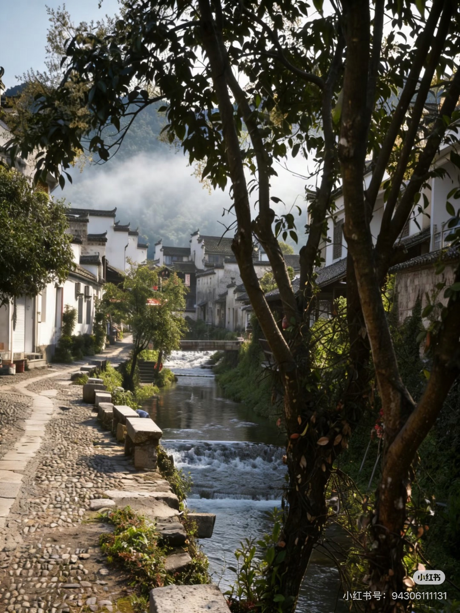
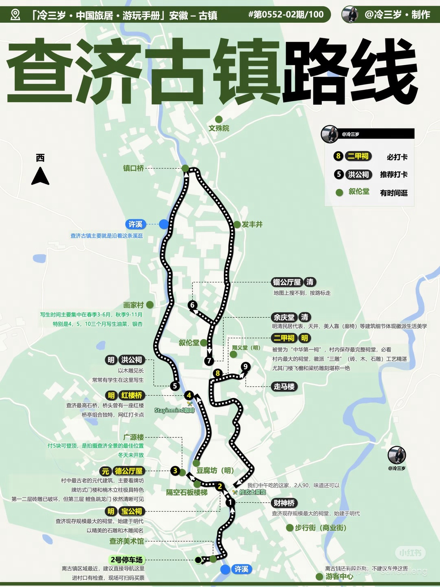
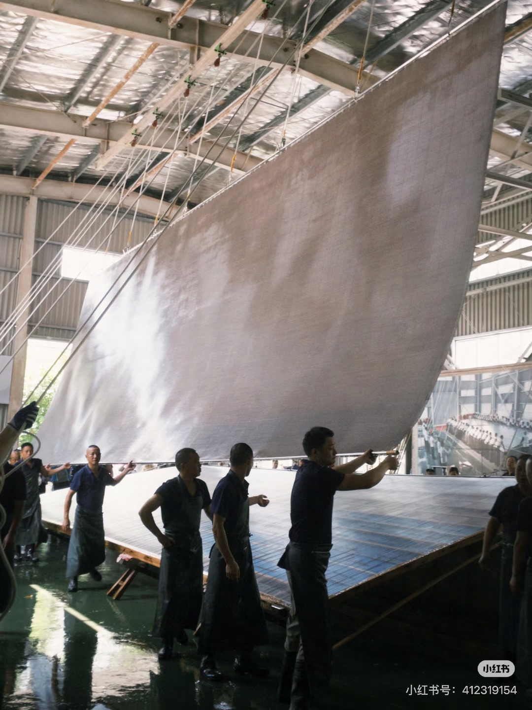
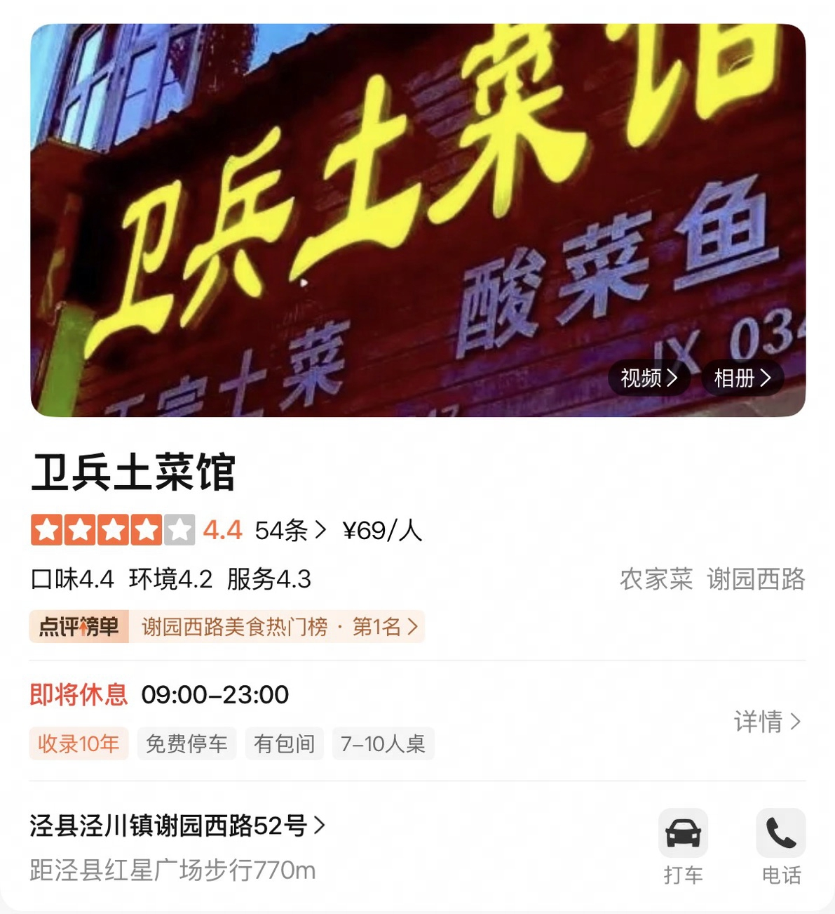
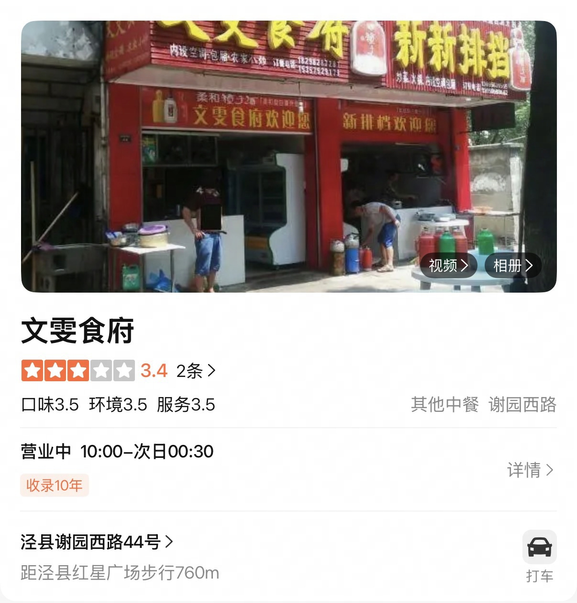
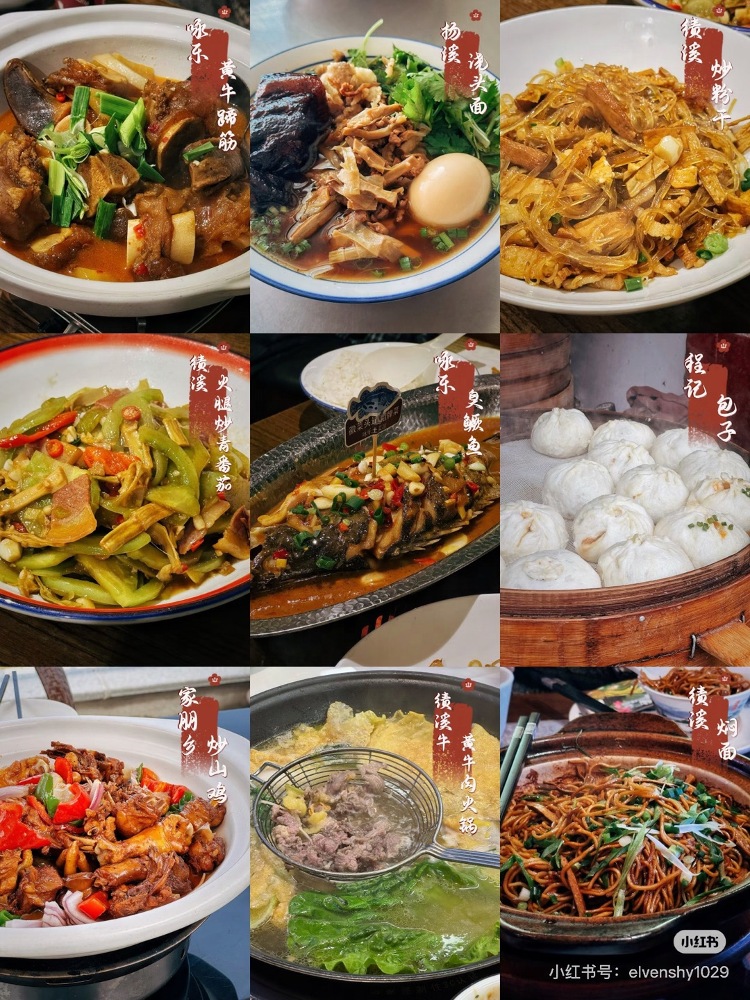
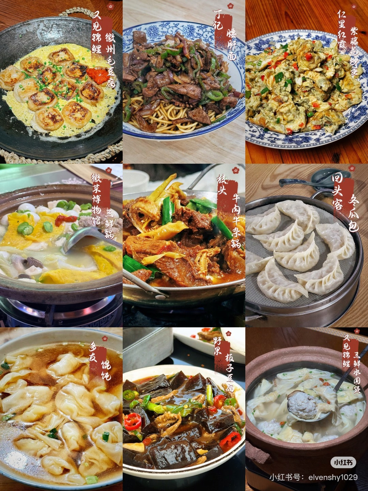

# 2026 端午 · 杭州→泾县→绩溪 旅行攻略

> 2人出行｜杭州出发｜全程高铁串联｜旅拍 + 竹筏 + 古村慢游


*▲ 查济古村·粉墙黛瓦掩映在皖南山色中*

---

## 📌 行程概览

| 项目 | 内容 |
|------|------|
| **出行日期** | 2026年6月19日（周五）- 6月21日（周日） |
| **天数** | 3天2晚（**不请假**） |
| **目的地** | 安徽 · 泾县（查济+桃花潭+宣纸园）+ 绩溪（龙川+老街） |
| **核心体验** | 桃花潭晨雾旅拍 · 竹筏漂流 · 宣纸非遗体验 · 徽派古村慢游 |
| **预算（2人）** | 约 3,200 - 3,660 元（不含旅拍）；含旅拍约 5,000 - 6,260 元 |
| **季节提示** | 6月皖南已入梅雨季，必带雨具，气温 25-33°C |

---

## 🚄 高铁车次（已确认 · 务必抢票）

| 班次 | 日期 | 时间 | 车次 | 单价 | 2人合计 | 开售时间 |
|------|------|------|------|------|--------|---------|
| 杭州东 → 泾县（黄山北中转） | 06/19 周五 | **09:33-12:04** | — | ¥173.5 | ¥347 | 06/05 10:00 |
| 泾县 → 绩溪北 | 06/20 周六 | **21:29-21:56** | G7745 | ¥32.5 | ¥65 | 06/06 10:00 |
| 绩溪北 → 杭州东 | 06/21 周日 | **18:31-19:49** | D5580 | ¥99 | ¥198 | 06/07 10:00 |

> 🎫 **抢票提醒**：在 12306 App "预约下单"，开售时间到自动秒杀。端午热门线路必须提前抢！

---

## 🗺️ 路线图

```
Day 1（周五）：杭州 09:33 ──高铁──► 泾县 12:04 ──打车──► 查济古村（自由拍照）──► 桃花潭西岸（住仙渡民宿·看打铁花🎆）
Day 2（周六）：仙渡民宿 04:00 ──► 西岸渡口晨雾旅拍+竹筏 ──► 宣纸文化园 ──► 泾县 21:29 ──高铁──► 绩溪 21:56
Day 3（周日）：龙川早班游 ──► 绩溪老街慢游 ──► 绩溪北 18:31 ──高铁──► 杭州 19:49
```

---

# Day 1（6/19 周五）：杭州 → 泾县 → 查济 → 桃花潭

> 关键词：高铁直达 · 烟雨古村 · 自由拍照 · 打铁花🎆

| 时间 | 安排 | 交通/备注 |
|------|------|------|
| 09:00 | 抵达杭州东站候车 | — |
| **09:33** | **杭州东 → 泾县**（黄山北中转停27分） | 高铁 2h31m / ¥173.5 |
| 12:04 | 抵达泾县站 | — |
| 12:30 | 泾县站附近午餐：**臭鳜鱼、泾县锅巴、蕨菜炒腊肉** | 步行5min |
| 13:30 | 打车前往 **查济古村**（约1h，约 80-100 元） | 滴滴/高德 |
| 14:30 | 抵达查济，雨中漫步古村，边玩边拍照记录 | 门票60/人 |
| 16:30 | 离开查济，打车前往 **桃花潭西岸**（约20min） | 约30-40元 |
| 17:00 | 抵达桃花潭，入住 **仙渡民宿** | — |
| 17:30 | 休息整顿，民宿附近散步 | — |
| 18:30 | 晚餐（民宿/桃花潭附近农家菜） | — |
| **20:00** | ⭐ **桃花潭东岸·烟花+打铁花🎆**（在景区即可观赏） | 端午特别活动 |
| 21:30 | 返回仙渡民宿休息，早睡（次日4:00起床） | — |


*▲ 查济古村：皖南最大古村落，明清三代建筑保存完好，溪水穿村而过，旅拍圣地*

### 🗺️ 查济游览路线图


*▲ 查济古镇游览路线参考图（图源小红书 · @冷三岁）*

### 🏠 住宿
- **桃花潭仙渡民宿** ✅ 已预订
- 位置：桃花潭西岸，步行即到西岸渡口（Day 2 晨雾拍摄点）
- 优势：免去次日凌晨赶路，起床即可拍晨雾

---

# Day 2（6/20 周六）：桃花潭晨雾旅拍 + 竹筏 + 宣纸园 → 绩溪

> 关键词：桃花潭晨雾旅拍 · 竹筏漂流 · 非遗体验 · 高铁夜行

| 时间 | 安排 | 交通/备注 |
|------|------|---------|
| **04:00** | ⭐ **起床！** 做妆造（如约了旅拍摄影师） | 旅拍899-1299/人，也可自己拍 |
| 05:00 | 步行前往 **西岸渡口**，晨雾正浓 | 民宿出门即到 |
| **05:30** | ⭐ **桃花潭晨雾旅拍**（黄金时段！晨雾+无人+柔光） | ⚠️ 7点多晨雾就散了 |
| 07:30 | 逛 **汪伦墓** → **踏歌古岸** → **怀仙阁**（追寻李白足迹） | 步行 |
| 08:30 | ⭐ **万家酒楼坐竹筏**（早班竹筏，水面如镜） | 30-50元/人 |
| 09:30 | 桃花潭附近吃早餐（古镇小吃/油条豆浆） | — |
| 10:30 | 自由漫步万村老街、太白楼 | 步行 |
| 12:00 | 桃花潭附近午餐：**溪鱼、农家菜** | — |
| 13:30 | 打车前往 **中国宣纸文化园**（约30min，60-80元） | — |
| 14:00 | ⭐ 参观宣纸制作全流程，**亲手捞一张宣纸**作为纪念（约1.5h） | — |


*▲ 中国宣纸文化园：曲面流线型建筑本身就值得打卡*


*▲ 千年非遗"捞纸"工艺：多人协作，揭起一张完整的大尺幅宣纸*

| 16:00-18:00 | 回泾县县城（约30min），根据时间考虑是否去泾县老街闲逛（适合采购伴手礼，如宣纸、宣笔、笋干、山核桃） | — |
| 19:00 | 泾县晚餐：**臭鳜鱼、笋干土鸡、河鲜** | — |
| 20:30 | 前往泾县站 | — |
| **21:29** | **泾县 → 绩溪北（G7745）** | 高铁 27min / ¥32.5 |
| 21:56 | 抵达绩溪北 | — |
| 22:00 | 步行/打车 → **格林豪泰智选酒店（绩溪县高铁北站店）** 入住 | 距高铁站很近 |


*▲ 桃花潭：青山绿水间的徽派村落，"桃花潭水深千尺，不及汪伦送我情"——李白名篇诞生地*


*▲ 晨雾中的竹筏漂流：水面如镜、灯笼悬岸，意境堪比山水画*

### 📸 桃花潭晨雾旅拍 Tips
- **平台**：小红书搜「桃花潭旅拍」「皖南旅拍摄影师」
- **价格**：**899-1299 元/人**（含化妆+服装+精修），也可以自己拍
- **黄金时段**：清晨 05:30-07:00（⚠️ 7点多晨雾就散了！）
- **集合地点**：桃花潭西岸渡口（仙渡民宿步行可达）
- **服装推荐**：新中式马面裙、汉服、白色棉麻裙，与青山绿水绝配
- ⚠️ 需提前跟摄影师确认清晨档期（4:00 见面做妆造）

### 🏨 住宿

- **格林豪泰智选酒店（绩溪县高铁北站店）** ✅ 已预订
- 优势：紧邻绩溪北站，21:56 下高铁后步行/短途打车即达，免去夜间长途奔波
- 次日早上从酒店打车去龙川约 15min

---

# Day 3（6/21 周日）：龙川早班游 + 绩溪慢游 → 返杭

> 关键词：早起龙川避高峰 · 古镇慢游 · 茶馆下午茶

| 时间 | 安排 | 交通/备注 |
|------|------|---------|
| 07:00 | 退房，行李存车上 | — |
| 07:30 | **绩溪老城区当地早餐**：回头客冬瓜包/丁记挞粿/绩溪炒粉丝（详见美食清单）| 打车10min |
| 08:30 | 打车 → **龙川景区**（约15min，约25元） | — |
| **09:00** | ⭐ **龙川早场游**（避开11点后大批旅游团！） | 约2.5h |


*▲ 绩溪龙川：千年徽州古村，依山傍水，国宝级胡氏宗祠木雕——只逛古村，不爬山*

**游览顺序**：胡氏宗祠（重点看木雕） → 奕世尚书坊 → 龙川水街 → 龙川胡氏宗祠（国保单位）

| 11:30 | 打车回绩溪县城 | 约15min |
| 12:00 | 绩溪午餐：**绩溪挞粿、一品锅、笋衣烧肉** | 当地老店 |
| 13:30 | 漫步 **绩溪老街**：徽州老街+本地市集烟火气 | 步行 |
| 14:30 | 🏛️ **绩溪博物馆**（备选）：徽派建筑精品，免门票，约1h | 雨天室内备选 |
| 15:30 | 茶馆下午茶 / 徽墨店打卡 | — |
| 16:30 | 简餐 | — |
| 17:45 | 打车 → 绩溪北站 | 约15min |
| **18:31** | **绩溪北 → 杭州东（D5580）** | 高铁 1h18m / ¥99 |
| **19:49** | 抵达杭州东 ✅ | — |

---

## 🍜 必吃美食清单


*▲ 徽菜之首·臭鳜鱼：闻起来奇香，吃起来鲜嫩——皖南必尝代表菜*

### 🌟 徽菜经典必尝（全程各地都有）

| 美食 | 说明 |
|------|------|
| 🐟 **臭鳜鱼** | 徽菜代表，腌制发酵后煎烧，外臭内香 |
| 🧀 **毛豆腐** | 发酵长毛的豆腐煎炸，徽州经典小吃 |
| 🍲 **一品锅 / 三鲜锅** | 多层食材叠放的徽州火锅，荤素搭配 |
| 🥟 **绩溪挞粿** | 类似韭菜盒子但馅料更丰富，绩溪特色面点 |
| 🎋 **笋干烧肉** | 时令山笋配五花肉，鲜香入味 |
| 🍘 **泾县锅巴** | 酥脆锅巴浇上浓汁，泾县特色主食 |

> 💡 臭鳜鱼和毛豆腐初次尝试可能需要适应，但一旦接受就会上瘾！绩溪挞粿一定要**趁热吃**。

---

### 🥘 泾县美食推荐

<table>
<tr>
<td align="center" width="33%"><br><sub>▲ 卫兵土菜馆·鸡锅仔</sub></td>
<td align="center" width="33%"><br><sub>▲ 三子饭店·糍粑烧鸡</sub></td>
<td align="center" width="33%"><br><sub>▲ 文雯食府·杂鱼锅仔</sub></td>
</tr>
</table>

#### 🔸 正餐

| 餐厅 | 招牌菜 |
|------|--------|
| **卫兵土菜馆** | 鸡锅仔、酸菜鱼、龙虾、青椒河虾 |
| **三子饭店** | 糍粑烧鸡、韭菜炒豆腐皮锅底 |
| **文雯食府** | 鸡烧糍粑、酸菜鱼/杂鱼锅仔、鸡脚烧鸡翅、臭鳜鱼 |

#### 🥖 早餐

> 💡 早餐都是本地人推荐的"家门口味道"，需要早起一点排队，没有外卖。

- **南门锅贴**
- **北门菜市场葱油饼**
- **皖南电机厂卫大饼** — 葱油强推！两位上了年纪的爷爷奶奶现做，要等几分钟（值得）

#### 🍜 面食

- **小卫香辣面馆**
- **老二中面馆**
- **205 老面馆**
- **嘉年华炒面**

#### 🍢 小吃

- **少年宫门口的粉丝饼**
- **中国银行门口阿姨的挞粿**（酸豆角馅好吃）
- **专一砂锅**
- **二中旁边的土豆粉**

#### 🔥 烧烤

- **阳光烧烤**
- **眼睛烧烤**

---

### 🥢 绩溪美食推荐

<table>
<tr>
<td align="center" width="50%"><br><sub>▲ 绩溪正餐九宫格·徽菜风味</sub></td>
<td align="center" width="50%"><br><sub>▲ 绩溪小吃九宫格·挞粿包子馄饨</sub></td>
</tr>
</table>

#### 🔸 正餐

| 餐厅 | 招牌菜 |
|------|--------|
| **校头** | 牛肉牛肚锅 |
| **湘遇阿本菜馆** | 酸萝卜炒肚丝、爆炒螺蛳、酱排骨 |
| **中国徽菜（徽厨）博物馆** | 三鲜锅 / 胡适一品锅、臭鳜鱼、毛豆腐、绩溪挞粿（边吃边了解徽菜文化） |
| **咏乐土菜馆** | 黄牛蹄筋、绩溪炒粉丝、臭鳜鱼 |
| **仁里红霞农家乐** | 紫藤花炒蛋（春末夏初限定时令菜） |
| **绩溪牛** | 黄牛肉火锅 |

#### 🥖 早餐

- **回头客** — 冬瓜包、绩溪挞粿
- **丁记** — 挞粿、馄饨、腰肝面
- **绩溪炒粉丝**（街边小店都有，本地人早餐主食）

> 🔖 **行程衔接建议**：
> - **Day 1 中午**到达泾县，可去 **卫兵土菜馆** 或 **三子饭店** 试糍粑烧鸡
> - **Day 2 晚餐**回泾县城后，**文雯食府** 杂鱼锅仔配臭鳜鱼最配高铁夜行
> - **Day 3 早餐**酒店附近就有炒粉丝，午餐可去 **中国徽菜博物馆** 一锅吃齐徽菜代表


## 💰 完整预算明细（2人合计）

| 项目 | 费用 | 备注 |
|------|------|------|
| 🚄 高铁（确认班次） | ¥610 | 杭州↔泾县↔绩溪↔杭州 |
| 🚖 打车（多段景区间） | ¥300-400 | 泾县→查济→桃花潭、桃花潭→宣纸园→泾县站 |
| 🏠 住宿（2晚） | ¥1,097 | 仙渡民宿 ¥815 + 格林豪泰智选 ¥282 |
| 🎫 门票 | ¥510 | 查济60 + 桃花潭70 + 宣纸园50 + 龙川75（每人） |
| 📸 **旅拍写真（可选）** | ¥1,800-2,600 | 899-1299/人，含妆造+服装+精修 |
| 🛶 **桃花潭竹筏** | ¥60-100 | 30-50元/人 |
| 🍴 餐饮（6正餐+2早餐） | ¥600-900 | 农家菜+徽菜 |
| **合计** | **约 ¥3,200 - 3,660（不含旅拍）** | 含旅拍约 ¥5,000 - 6,260 |

---

## ✅ 行前准备清单

### 必带物品
- [ ] **雨具**（6月梅雨季，必备！折叠伞+轻便雨衣）
- [ ] 防晒霜（SPF50+）+ 太阳镜 + 帽子
- [ ] 舒适步行鞋（古村石板路 + 老街徒步）
- [ ] 驱蚊水（山区蚊虫多）
- [ ] 充电宝 + 相机/手机
- [ ] 现金少量（部分古村小店不支持线上支付）
- [ ] 身份证 + 高铁票

### 旅拍服装
- [ ] 新中式马面裙 / 汉服 / 白色棉麻裙
- [ ] 简约耳饰、发簪等小配饰
- [ ] 备用平底鞋（拍照走石板路）

### 提前预订
- [ ] **高铁票**（开售即抢，端午热门）
- [ ] **桃花潭仙渡民宿**（6/19入住）✅ 已预订
- [ ] **格林豪泰智选酒店（绩溪县高铁北站店）**（6/20入住，备注晚到）✅ 已预订
- [ ] **旅拍摄影师**（小红书提前1周约，确认清晨档期）
- [ ] **下载App**：12306、滴滴/高德、携程/美团

---

## ⚠️ 重要提示

### 1. 抢票节奏
- 06/05 10:00 抢杭州东→泾县（最重要！这班车热门）
- 06/06 10:00 抢泾县→绩溪北 G7745
- 06/07 10:00 抢绩溪北→杭州东 D5580

### 2. 龙川早起避人流
- **8:30 抵达景区**（开门时间）
- 11:00 之前完成游览
- 11:00 后大批旅游团涌入

### 3. 雨天预案
- 6月梅雨季，建议查询天气预报
- 如下雨：减少户外行走，增加民宿茶歇/室内体验时间
- 桃花潭竹筏雨天可能停运，建议提前致电景区确认

### 4. 应急联系
- 泾县汽车站：**0563-5022222**
- 桃花潭景区：12301（全国旅游服务热线）
- 滴滴客服：4006772626

---

## 📍 关键地址速查

| 地点 | 地址 |
|------|------|
| 查济古村 | 安徽省宣城市泾县桃花潭镇查济村 |
| 桃花潭 | 安徽省宣城市泾县桃花潭镇 |
| 中国宣纸文化园 | 安徽省宣城市泾县乌溪镇 |
| 龙川景区 | 安徽省宣城市绩溪县瀛洲镇龙川村 |
| 绩溪老街 | 安徽省宣城市绩溪县华阳镇 |
